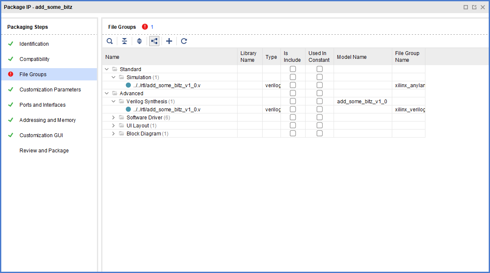

# Introduction
This repository contains no code. I will be adding TCL snippets to avoid the use of Vivado "Project Mode".

If you are like me, just wanting to take an occasional peek at FPGAs in your spare time, you might want to try something that works but most likely you appreciate getting something done and start by the book. The book by Xilinx will tell you to go by Vivado in "project mode" and since it very looks like anything any decent IDE does, you get on it. After all, it is supposed to be the best for basic use and that's what we do right? What's the point to complicate your life with all the advanced solutions? Sure, people are using them for their advanced projects but we can just afford to take it easy isn't it?

Not quite. You soon find out Vivado has many shortcomings in "Project" mode. Eventually the system goes a way you spend more time fighting it than working on your interests. You even need to consume nonsensical amounts of efforts in trying to understand what should be in source-control and what is byproduct. 

I'm fed enough with that.

Let me clarify a thing: officially "project mode" is when you fiddle with an `.xpr` file. The issue isn't really with this `.xpr` file by itself; it is fairly decent idea in concept. The issue is in how it is built and in its assumptions. The real issue is in all the implicit, taken for granted ideas it brings with it.

The way Vivado and the Synthesis/Implementation works is you always need a project in a broader sense: the `.xpr` is the "official" project but TCL scripts can provide projects as well. This might be shocking if you think in terms of stickers but I don't; for all practical purposes they could call it *bucket mode* and *butterfly mode* and it would make no difference but what's the point?

The point is: you have heard about TCL mode but you are concerned the documentation is sparse and incomplete. You find snippets here and there, but it seems you'll have to string them together into a workflow. The TCL is deemed "complicated" and it's like 1234 pages. In this situation no wonder the official project mode keeps staying alive.

In this repository, I will try to aggregate everything needed to pull up a decent flow with no `.xpr` files. I also ban the use of everything involving the official project mode (many resources I found firstly hook up to creating a project first, and this becomes absolutely opaque real fast).

I will be building lean-and-mean projects by means of basic TCL commands only. No shortcuts allowed. By the time this is finished, I hope we'll all agree there is a kind of project expressed by TCL which is just a better, simpler, idea.

# Proposed flows

Those documents will attempt to build a methodology to produce work in multiple, iterative steps. For the time being I'll be focusing on compute acceleration.

1. At first, you have a need. You analyze the designed algorithm and figure how to interface it.
2. Let's agree to put it as an AXI IP to be later used in a block design
3. You therefore need a *main* project and a *device* project; after creating the second, you'll be working on it most of the time
4. The device project will get source (Verilog and SystemVerilog) and bench sources. We iterate on this project till a "release" (not necessarily production-ready)
5. The device is exported back to the *main* project as means of a component for block design integration. What does this include? Conventional wisdom suggests to include testbenches and several documentation files but I disagree. In most languages, libraries are just code and I will be focusing on that.

The document is divided in a few sections, while all try to build this workflow, none is a direct mapping as this is a work in progress.

# Pseudo-reference

Collects various informations about the [TCL commands](./pseudo-reference/README.md) involved and resulting TCL structure values. Ideally includes information about `ipx::*` and `ipgui::*` commands as well as those reported by UG835 (Vivado Design Suite Tcl Command Reference Guide).

The goal of this section is to be a go-to for details. There's little to no effort in putting things together unless necessary to collect additional usage information. Meant to isolate a minimum amount of commands, in case you think grokking UG835 is a bit scary (1910 pages for 2020.2).

# Officially making a device

Document and examine the flow of creating an AXI device by GUI so I can annotate the TCL and later reproduce the results.

1. [Creating the main project](./canon/01_main_creation/README.md)
2. [Initiating generation of device project](./canon/02_device_creation/README.md)
3. [Customizing the device](./canon/03_device_customization/README.md)
4. [Data dump](./canon/04_dump) of the GUI generated component.

# The sad TCL crunch

I wish I had the foresight to track this process in more detail but the thing is I've tried many options and the focus shifted several times.
As a start, I'd like to use TCL to have control but it gets quite verbose. Besides, nothing I tried really worked. I therefore approached the problem again
and attempted a more incremental approach. I think a good helping material suggests what to do and what to avoid so you can save your time.

I really tried to go by TCL but it seems there's some pixie dust involving `ipgui` parameters. I found `merge_project_changes` can do the work behind the scenes for us so I'll be starting from there.

1. A failing [minimalistic attempt](./tcl-failing-attempts/01-minimalistic-merge-hdl) involving the bare minimum data. FAIL.
2. Improving the minimalistic attempt by [explicitly providing AXI map](./tcl-failing-attempts/02-providing-axi-map). I think there's a lot of value in this attempt, perhaps it is a good base but it's still not what I want so it still gets a FAIL.
3. Just do as [XAPP1168 suggests](./tcl-failing-attempts/03-xapp1168) suggests. If it's enough for you just go for it. I need something more and as far as I am concerned it's one of the most spectacular FAIL.

# Something working
In truth, this was the first thing I attempted. The amount of pain is incredible; maybe you had enough reading about the perils in (./pseudo-reference/ug835/generate_peripheral.md) and all the related documents but I sure feel I didn't vent enough.

## Partial generation
Execute [the script](mini.tcl), then `ipx::open_ipxact_file ./_tmp_packing/add_some_bitz_0.7/component.xml`.
This section is just a note as the thing has been [discussed already](./pseudo-reference/ug835/generate_peripheral.md).

Long story short: `generate_peripheral` gives you a pair of *template* RTL files to be used to *start* your work from scratch.
What I am doing is different: my work is already done and I want to pack it. My understanding of UG835 is there's no way to prevent those files to be output
so the next sections will investigate (again?) the required work to patch up the decisions by the internal machinery.

## Moving the files 
After executing [the script](moving.tcl), I examined the produced package by `start_gui` and `ipx::open_ipxact_file ./_tmp_packing/add_some_bitz_0.7/component.xml`.
This actually looks fairly great, I only need to merge the custom parameters and we would be golden.

## Adding custom parameters
This is what everything crumbled previously. Just defining parameters by the appropriate call would result in something like this:
```
ipgui::add_param -name {MERGE_OP} -component $periph -display_name {Merge Operation} -show_label {true} -show_range {true} -widget {comboBox}
# Vivado% ipgui::add_param -name {MERGE_OP} -component $periph -display_name {Merge Operation} -show_label {true} -show_range {true} -widget {comboBox}
# WARNING: [IP_Flow 19-469] Gui parameter('MERGE_OP') creation is incomplete. Corresponding component parameter does not exist
# MERGE_OP
```

I have looked to better understand the origin of the message with no luck but I got the feeling `ipgui` commands are to be issued. Those are basically unocumented.
Luckly, I have now discovered `ipx::merge_project_changes hdl_parameters` generates a GUI and creates the necessary structures so can I blend it in? [Of course not!](https://www.youtube.com/watch?v=6VF5P7qLaEQ). After executing the previous script, run `ipx::merge_project_changes hdl_parameters $periph`.

Accept resistance is futile while the command goes on and mutilates yet again our data structures:
```
ipx::merge_project_changes hdl_parameters $periph
INFO: [Ipptcl 7-560]  
WARNING: [IP_Flow 19-5109] File Group 'xilinx_verilogsynthesis (Verilog Synthesis)': File 'c:/vivnonproj/hack_da_ip_packagar/_tmp_packing/add_some_bitz_0.7/hdl/add_some_bitz_v1_0.v' does not exist in the project sources. It has been removed from the packaged IP. If still required, please add this file to the project, merge sources and re-package.
WARNING: [IP_Flow 19-5109] File Group 'xilinx_verilogsynthesis (Verilog Synthesis)': File 'c:/vivnonproj/hack_da_ip_packagar/_tmp_packing/add_some_bitz_0.7/hdl/mdz_custom_logic.sv' does not exist in the project sources. It has been removed from the packaged IP. If still required, please add this file to the project, merge sources and re-package.
WARNING: [IP_Flow 19-5109] File Group 'xilinx_verilogsynthesis (Verilog Synthesis)': File 'c:/vivnonproj/hack_da_ip_packagar/_tmp_packing/add_some_bitz_0.7/hdl/add_some_bitz_v1_0_S00_AXI.sv' does not exist in the project sources. It has been removed from the packaged IP. If still required, please add this file to the project, merge sources and re-package.
INFO: [IP_Flow 19-3166] Bus Interface 'S00_AXI': References existing memory map 'S00_AXI'.
1
Vivado%
```
.

Not shown: yes we got our parameters correctly defined. But at what cost?
The RTL files were taken from project again (remember I imported only a single file?); its path is not conforming to the typical use.
Another simulation file group has been introduced, discussed that already.

Adding the merge operation at the end of the previous script is a recipe for disaster. A better idea would be to *merge* right after *generate*.
As the in-memory project is not really useful, one could just populate the synthesis file group again (everything in the filesystem is fine) but along the
same line, I adjust project files just after placing them in the correct path so I can avoid warnings about removal of unused files. Note this must be done *after* generate peripheral due to its habit to generate the wrapper/instantiator and big mux files, so I need to scatter a bit of operations to obtain a [almost working](./almost_working.tcl).

Feel free to compare with the previous files. This one stops here to allow to better assess the changes.

