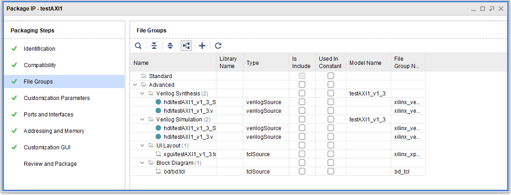
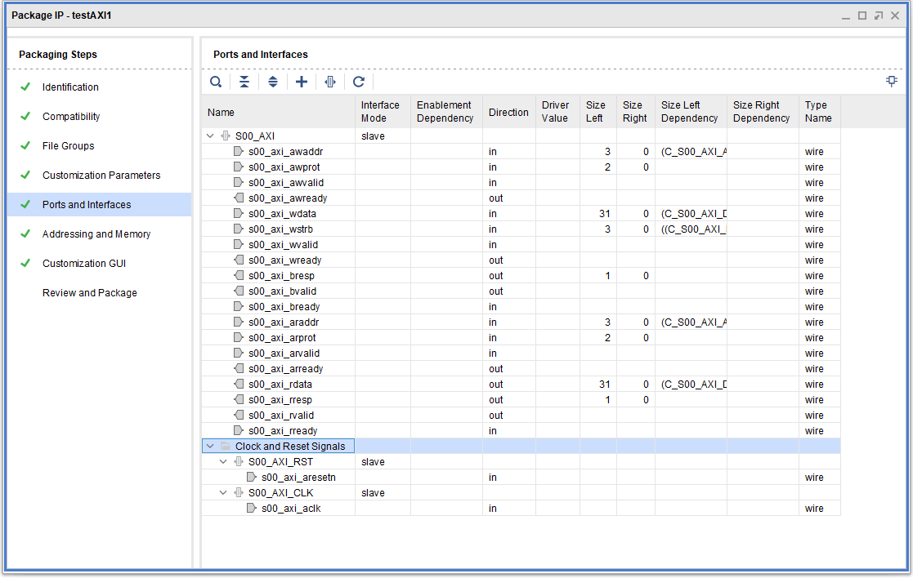
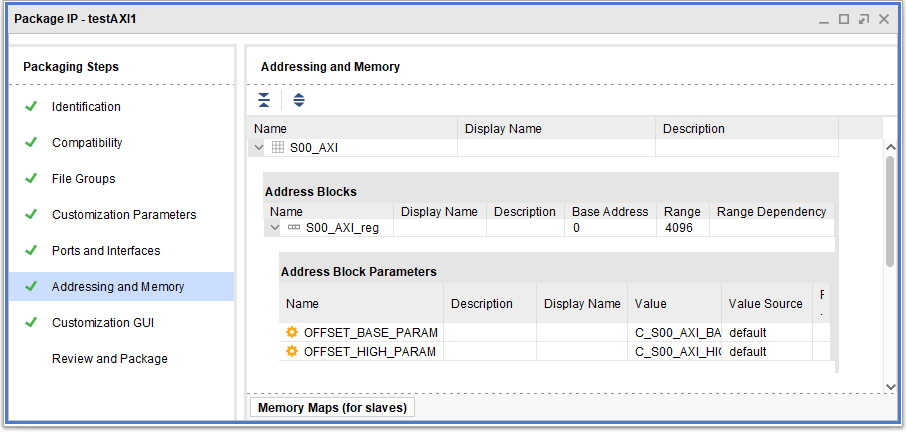

# Example peripheral data

UG835 contains the following code to demonstrate `generate_peripheral`:
```
set perifObj [ create_peripheral {myCompany.com} {user} {testAXI1} \
{1.3} -dir {C:/Data/new_periph} ]
add_peripheral_interface {S0_AXI} -interface_mode {slave} \
-axi_type {lite} $perifObj
add_peripheral_interface {S1_AXI} -interface_mode {slave} \
-axi_type {lite} $perifObj
generate_peripheral -driver -bfm_example_design \
-enable_interrupt $perifObj
write_peripheral $perifObj
set_property ip_repo_paths C:/Data/new_periph [current_fileset]
update_ip_catalog -rebuild
```

This example means little to nothing as the output would be:
```
Vivado% set perifObj [ create_peripheral {myCompany.com} {user} {testAXI1} {1.3} -dir {C:/Data/new_periph} ]
ERROR: [Common 17-53] User Exception: No open project. Please create or open a project before executing this command.
```

Lovely.

Note this is known to be wrong, at least in terms of error description as I have generated peripherals in non-project mode as I am writing this (albeit not quite as I wanted).
It seems you need to load at least a file. Let's execute a more minimal example:

```
read_verilog -sv mdz_custom_logic.sv
set periph [ create_peripheral {myCompany.com} {user} {testAXI1} {1.3} ]
add_peripheral_interface {S00_AXI} -interface_mode {slave} -axi_type {lite} $periph
generate_peripheral $periph
```

This would generate in the current directory a subtree such as
```
[.srcs](./minimal-generation)
|_ sources_1
   |_ ip
      |_ testAXI1_1.3
         |_ bd
         |  |_ bd.tcl
         |_ hdl
         |  |_ testAXI1_v1_3.v
         |  |_ testAXI1_v1_3_S00_AXI.v
         |_ xgui
            |_ testAXI1_v1_3.tcl
```

Then, by the means of [this script](./explore-minimal-generation.tcl), the following values are obtained.

Properties of the `$periph` object itself, which is the *component* we want to pack.

| Property                           | Immediatly after creation                  | After adding AXI | After `generate_peripheral`   |
|------------------------------------|--------------------------------------------|------------------|-------------------------------|
| ADD_DONT_TOUCH                     | 0                                          |  *&lt;same&gt;*  | *&lt;same&gt;*
| ADVERTISEMENT_IP                   | 0                                          |  *&lt;same&gt;*  | *&lt;same&gt;*
| ADVERTISEMENT_URL                  |                                            |  *&lt;same&gt;*  | *&lt;same&gt;*
| AUTO_DEVICE_PROPERTIES_FILTER      |                                            |  *&lt;same&gt;*  | *&lt;same&gt;*
| AUTO_FAMILY_SUPPORT_LEVEL          |                                            |  *&lt;same&gt;*  | *&lt;same&gt;*
| BLOCK_IP                           | 0                                          |  *&lt;same&gt;*  | *&lt;same&gt;*
| CHECKSUMS                          |                                            |  *&lt;same&gt;*  | *&lt;same&gt;*
| CLASS                              | component                                  |  *&lt;same&gt;*  | *&lt;same&gt;*
| COMPANY_URL                        |                                            |  *&lt;same&gt;*  | *&lt;same&gt;*
| CORE_REVISION                      | 1                                          |  *&lt;same&gt;*  | *&lt;same&gt;*
| CREATION_DATE_TIME                 |                                            |  *&lt;same&gt;*  | *&lt;same&gt;*
| DEBUG_CORE_INFO                    | 0                                          |  *&lt;same&gt;*  | *&lt;same&gt;*
| DEFAULT_USER_PARAMETER_ADDED       | 0                                          |  *&lt;same&gt;*  | 1
| DEFINITION_SOURCE                  | unknown                                    |  *&lt;same&gt;*  | *&lt;same&gt;*
| DESCRIPTION                        | Peripheral IP template                     |  *&lt;same&gt;*  | *&lt;same&gt;*
| DESIGN_TOOL_CONTEXTS               | All                                        |  *&lt;same&gt;*  | *&lt;same&gt;*
| DEVICE_INDEPENDENT_SYNTH           | 0                                          |  *&lt;same&gt;*  | *&lt;same&gt;*
| DIRTY                              | 1                                          |  *&lt;same&gt;*  | *&lt;same&gt;*
| DISPLAY_NAME                       | testAXI1                                   |  *&lt;same&gt;*  | *&lt;same&gt;*
| EXAMPLE_DESIGN_NO_IP_IMPORT        | 0 <br> WARNING: [IP_Flow 19-845] The 'expected_filegroups' property has been replaced by the 'ipx::report_possible_file_groups' command.
| EXPECTED_FILEGROUPS                | xilinx_unknown xilinx_project_archive xilinx_elaborateports xilinx_elaborateprecontents xilinx_elaboratesubcores xilinx_elaboratebd xilinx_elaboratepostcontents xilinx_anylanguagehls xilinx_vhdlhlssynthesis xilinx_veriloghlssynthesis xilinx_anylanguagehlssynthesis xilinx_vhdlhlssimulation xilinx_veriloghlssimulation xilinx_anylanguagehlssimulation xilinx_vhdlinstantiationtemplate xilinx_veriloginstantiationtemplate xilinx_anylanguageinstantiationtemplate xilinx_vhdlsynthesis xilinx_verilogsynthesis xilinx_anylanguagesynthesis xilinx_vhdlsourcedelivery xilinx_verilogsourcedelivery xilinx_anylanguagesourcedelivery xilinx_structuralnetlist xilinx_synthesisconstraints xilinx_synthesismemoryarchive xilinx_synthesischeckpoint xilinx_vhdlsynthesiswrapper xilinx_verilogsynthesiswrapper xilinx_anylanguagesynthesiswrapper xilinx_implementation xilinx_vhdlbehavioralsimulation xilinx_verilogbehavioralsimulation xilinx_hybridsimulation xilinx_systemcsimulation xilinx_anylanguagebehavioralsimulation xilinx_simulationmemoryarchive xilinx_simulationcheckpoint xilinx_vhdlsimulationwrapper xilinx_verilogsimulationwrapper xilinx_hybridsimulationwrapper xilinx_systemcsimulationwrapper xilinx_anylanguagesimulationwrapper xilinx_vhdltestbench xilinx_verilogtestbench xilinx_testbench xilinx_cmodelsimulation xilinx_matlabmodels xilinx_systemgeneratormodels xilinx_miscfiles xilinx_exporttosdk xilinx_catalogicon xilinx_catalogdisabledicon xilinx_coreguiicon xilinx_miffiles xilinx_datasheet xilinx_encrypteddatasheet xilinx_gettingstartedguide xilinx_productguide xilinx_versioninformation xilinx_readme xilinx_documentation xilinx_vhdlexamples xilinx_verilogexamples xilinx_examples xilinx_examplessynthesis xilinx_examplessimulation xilinx_examplesimplementation xilinx_examplesscriptext xilinx_examplesscript xilinx_referencedesign xilinx_upgradescripts xilinx_softwaredriver xilinx_externalfiles xilinx_sharedlogic xilinx_hardwarehandoff xilinx_powerdata xilinx_iodata xilinx_xpgui xilinx_xpguicustom xilinx_xpgdrc xilinx_blockdiagram xilinx_utilityxitfiles xilinx_cgvhdlsynthesis xilinx_cgverilogsynthesis xilinx_cganylanguagesynthesis xilinx_cgvhdlsourcedelivery xilinx_cgverilogsourcedelivery xilinx_cganylanguagesourcedelivery xilinx_cgstructuralnetlist xilinx_cgimplementation xilinx_cgvhdlbehavioralsimulation xilinx_cgverilogbehavioralsimulation xilinx_cganylanguagebehavioralsimulation xilinx_cgvhdltestbench xilinx_cgverilogtestbench xilinx_cgtestbench xilinx_cgvhdlinstantiationtemplate xilinx_cgveriloginstantiationtemplate xilinx_cgvhdlsynthesiswrapper xilinx_cgverilogsynthesiswrapper xilinx_cgvhdlsimulationwrapper xilinx_cgverilogsimulationwrapper xilinx_cgcmodelsimulation xilinx_cgmatlabmodels xilinx_cgsystemgeneratormodels xilinx_cgmiscfiles xilinx_cgcatalogicon xilinx_cgcatalogdisabledicon xilinx_cgcoreguiicon xilinx_cgmiffiles xilinx_cgdatasheet xilinx_cgencrypteddatasheet xilinx_cggettingstartedguide xilinx_cgversioninformation xilinx_cgreadme xilinx_cgdocumentation xilinx_cgexamples xilinx_cgexamplessynthesis xilinx_cgexamplessimulation xilinx_cgexamplesimplementation xilinx_cgreferencedesign xilinx_guilayout xilinx_uimodel xilinx_allejava xilinx_associatedfiles xilinx_coregenlegacy xilinx_utility xilinx_generatorfiles xilinx_licensedsources xilinx_synthesisconstraints xilinx_implementationconstraints xilinx_instantiationtemplates xilinx_viewlogicsymbols xilinx_schematicsymbols xilinx_foundationsymbols xilinx_coresymbol xilinx_vhdlmiscfiles xilinx_verilogmiscfiles xilinx_vhdlrtlsimulation xilinx_verilogrtlsimulation xilinx_any_languagertlsimulation xilinx_cgallviews
| HIDE_IN_GUI                        | 0                                          |  *&lt;same&gt;*  | *&lt;same&gt;*
| INTEGRITY_REPORT_FILE_NAME         | packager_integrity_report.html             |  *&lt;same&gt;*  | *&lt;same&gt;*
| LIBRARY                            | user                                       |  *&lt;same&gt;*  | *&lt;same&gt;*
| NAME                               | testAXI1                                   |  *&lt;same&gt;*  | *&lt;same&gt;*
| PAYMENT_REQUIRED                   | 0                                          |  *&lt;same&gt;*  | *&lt;same&gt;*
| PREVIOUS_VERSION_FOR_UPGRADE       |                                            |  *&lt;same&gt;*  | *&lt;same&gt;*
| REQUIRES_VIP                       | 0                                          |  *&lt;same&gt;*  | *&lt;same&gt;*
| RETAIN_COMPONENT_INTEGER_PORT_TYPE | 0                                          |  *&lt;same&gt;*  | *&lt;same&gt;*
| ROOT_DIRECTORY                     | *&lt;SRCDIR&gt;*/.srcs/sources_1/ip  |  *&lt;same&gt;*  | *&lt;SRCDIR&gt;*/defaults/.srcs/sources_1/ip/testAXI1_1.3
| SDX_KERNEL                         | 0                                          |  *&lt;same&gt;*  | *&lt;same&gt;*
| SDX_KERNEL_TYPE                    |                                            |  *&lt;same&gt;*  | *&lt;same&gt;*
| SECURITY_CHECKED                   | 0                                          |  *&lt;same&gt;*  | *&lt;same&gt;*
| SUMMARY_REPORT_FILE_NAME           | packager_summary_report.html               |  *&lt;same&gt;*  | *&lt;same&gt;*
| SUPPORTED_FAMILIES                 | artix7 Pre-Production                      |  *&lt;same&gt;*  | *&lt;same&gt;*
| SUPPORTS_AUTO_SLRS                 | 1                                          |  *&lt;same&gt;*  | *&lt;same&gt;*
| SUPPORTS_AUTO_XDC                  |                                            |  *&lt;same&gt;*  | *&lt;same&gt;*
| SUPPORTS_DEFERRED_ELABORATION      | 0                                          |  *&lt;same&gt;*  | *&lt;same&gt;*
| SUPPORTS_DYNAMIC_BITSTRINGS        | 0                                          |  *&lt;same&gt;*  | *&lt;same&gt;*
| SUPPORTS_IP_CACHE                  |                                            |  *&lt;same&gt;*  | *&lt;same&gt;*
| SUPPORTS_OOC                       |                                            |  *&lt;same&gt;*  | *&lt;same&gt;*
| SUPPORTS_VIVADO                    | 1                                          |  *&lt;same&gt;*  | *&lt;same&gt;*
| SYSTEMC_LIBRARIES                  |                                            |  *&lt;same&gt;*  | *&lt;same&gt;*
| TAGS                               |                                            |  *&lt;same&gt;*  | *&lt;same&gt;*
| TAXONOMY                           | AXI_Peripheral                             |  *&lt;same&gt;*  | *&lt;same&gt;*
| UNSUPPORTED_SIMULATORS             |                                            |  *&lt;same&gt;*  | *&lt;same&gt;*
| USE_VIVADO_HLS                     | 0                                          |  *&lt;same&gt;*  | *&lt;same&gt;*
| VENDOR                             | myCompany<span>.com</span>                 |  *&lt;same&gt;*  | *&lt;same&gt;*
| VENDOR_DISPLAY_NAME                |                                            |  *&lt;same&gt;*  | *&lt;same&gt;*
| VERSION                            | 1.3                                        |  *&lt;same&gt;*  | *&lt;same&gt;*
| VLNV                               | myCompany<span>.com</span>:user:testAXI1:1.3 |  *&lt;same&gt;*  | *&lt;same&gt;*
| XILINX_VERSION                     |                                            |  *&lt;same&gt;*  | *&lt;same&gt;*
| XILINX_VERSION_COMPATIBILITY       |                                            |  *&lt;same&gt;*  | *&lt;same&gt;*
| XML_FILE_NAME                      | *&lt;SRCDIR&gt;*/.srcs/sources_1/ip/component.xml |  *&lt;same&gt;*  | *&lt;SRCDIR&gt;*/.srcs/sources_1/ip/testAXI1_1.3/component.xml
| XPM_LIBRARIES                      |                                            |  *&lt;same&gt;*  | *&lt;same&gt;*

Note: in the above *&lt;SRCDIR&gt;* is the directory where I started Vivado. Substituted for clarity.

The component features additional content which is to be pulled by the appropriate `get_` command.

# Files in their groups
A picture is better than a thousand words so let's check out the thing graphically, as it would appear in the IP packager:


Let's examine the result of `ipx::get_file_groups -of_objects $periph`. It is a list of 4 `file_group` objects.

| Index | Property           | Observed value     |
|-------|--------------------|--------------------|
|   0   | CLASS              | file_group |
|   0   | COMPONENT_SUBCORES |  |
|   0   | DEPENDENCY         |  |
|   0   | DESCRIPTION        |  |
|   0   | DISPLAY_NAME       | Verilog Synthesis |
|   0   | ENV_IDS            | verilogSource:vivado.xilinx<span>.com</span>:synthesis |
|   0   | LANGUAGE           | verilog |
|   0   | MODEL_NAME         | testAXI1_v1_3 |
|   0   | NAME               | xilinx_verilogsynthesis |
|   0   | TYPE               | verilog:synthesis |
|   1   | CLASS              | file_group |
|   1   | COMPONENT_SUBCORES |  |
|   1   | DEPENDENCY         |  |
|   1   | DESCRIPTION        |  |
|   1   | DISPLAY_NAME       | Verilog Simulation |
|   1   | ENV_IDS            | verilogSource:vivado.xilinx<span>.com</span>:simulation |
|   1   | LANGUAGE           | verilog |
|   1   | MODEL_NAME         | testAXI1_v1_3 |
|   1   | NAME               | xilinx_verilogbehavioralsimulation |
|   1   | TYPE               | verilog:simulation |
|   2   | CLASS              | file_group |
|   2   | COMPONENT_SUBCORES |  |
|   2   | DEPENDENCY         |  |
|   2   | DESCRIPTION        |  |
|   2   | DISPLAY_NAME       | UI Layout |
|   2   | ENV_IDS            | :vivado.xilinx<span>.com</span>:xgui.ui |
|   2   | LANGUAGE           |  |
|   2   | MODEL_NAME         |  |
|   2   | NAME               | xilinx_xpgui |
|   2   | TYPE               | gui |
|   3   | CLASS              | file_group |
|   3   | COMPONENT_SUBCORES |  |
|   3   | DEPENDENCY         |  |
|   3   | DESCRIPTION        |  |
|   3   | DISPLAY_NAME       | Block Diagram |
|   3   | ENV_IDS            | :vivado.xilinx<span>.com</span>:block.diagram |
|   3   | LANGUAGE           |  |
|   3   | MODEL_NAME         |  |
|   3   | NAME               | bd_tcl |
|   3   | TYPE               | block_diagram |

A bit of trivia but for the sake of completeness, here are the various files. Oddly enough, even though `ipx::get_files -help` says `-of_objects` can pull files from the component, it seems files can exist in file groups only. The help message is a bit funny so I have to take a bit more effort pull them out.

For the purpose of better understanding, I will refer to file groups by a name (also, use those names to look up the script). You can still get this info from `FILE_GROUP_NAME` property but in case you want to take it easy, that's it.

| Index | Nickname |
|-------|----------|
|   0   | synthFiles |
|   1   | simFiles |
|   2   | guiFiles |
|   3   | bdFiles  |

| Group      | Index | Property         | Observed value |
|------------|-------|------------------|----------------|
| synthFiles |   0   | CELL_NAME        |  |
| synthFiles |   0   | CLASS            | file |
| synthFiles |   0   | DEPENDENCY       |  |
| synthFiles |   0   | DESCRIPTION      |  |
| synthFiles |   0   | EXPORTED_NAMES   |  |
| synthFiles |   0   | FILE_GROUP_NAME  | xilinx_verilogsynthesis |
| synthFiles |   0   | IS_INCLUDE       | 0 |
| synthFiles |   0   | LIBRARY_NAME     |  |
| synthFiles |   0   | NAME             | hdl/testAXI1_v1_3_S00_AXI.v |
| synthFiles |   0   | PROCESSING_ORDER | normal |
| synthFiles |   0   | SCOPED_TO_CELLS  |  |
| synthFiles |   0   | SCOPED_TO_REF    |  |
| synthFiles |   0   | TYPE             | verilogSource |
| synthFiles |   0   | USED_IN          |  |
| synthFiles |   0   | XGUI_VERSION     |  |
| synthFiles |   1   | CELL_NAME        |  |
| synthFiles |   1   | CLASS            | file |
| synthFiles |   1   | DEPENDENCY       |  |
| synthFiles |   1   | DESCRIPTION      |  |
| synthFiles |   1   | EXPORTED_NAMES   |  |
| synthFiles |   1   | FILE_GROUP_NAME  | xilinx_verilogsynthesis |
| synthFiles |   1   | IS_INCLUDE       | 0 |
| synthFiles |   1   | LIBRARY_NAME     |  |
| synthFiles |   1   | NAME             | hdl/testAXI1_v1_3.v |
| synthFiles |   1   | PROCESSING_ORDER | normal |
| synthFiles |   1   | SCOPED_TO_CELLS  |  |
| synthFiles |   1   | SCOPED_TO_REF    |  |
| synthFiles |   1   | TYPE             | verilogSource |
| synthFiles |   1   | USED_IN          |  |
| synthFiles |   1   | XGUI_VERSION     |  |
| simFiles   |   0   | CELL_NAME        |  |
| simFiles   |   0   | CLASS            | file |
| simFiles   |   0   | DEPENDENCY       |  |
| simFiles   |   0   | DESCRIPTION      |  |
| simFiles   |   0   | EXPORTED_NAMES   |  |
| simFiles   |   0   | FILE_GROUP_NAME  | xilinx_verilogbehavioralsimulation |
| simFiles   |   0   | IS_INCLUDE       | 0 |
| simFiles   |   0   | LIBRARY_NAME     |  |
| simFiles   |   0   | NAME             | hdl/testAXI1_v1_3_S00_AXI.v |
| simFiles   |   0   | PROCESSING_ORDER | normal |
| simFiles   |   0   | SCOPED_TO_CELLS  |  |
| simFiles   |   0   | SCOPED_TO_REF    |  |
| simFiles   |   0   | TYPE             | verilogSource |
| simFiles   |   0   | USED_IN          |  |
| simFiles   |   0   | XGUI_VERSION     |  |
| simFiles   |   1   | CELL_NAME        |  |
| simFiles   |   1   | CLASS            | file |
| simFiles   |   1   | DEPENDENCY       |  |
| simFiles   |   1   | DESCRIPTION      |  |
| simFiles   |   1   | EXPORTED_NAMES   |  |
| simFiles   |   1   | FILE_GROUP_NAME  | xilinx_verilogbehavioralsimulation |
| simFiles   |   1   | IS_INCLUDE       | 0 |
| simFiles   |   1   | LIBRARY_NAME     |  |
| simFiles   |   1   | NAME             | hdl/testAXI1_v1_3.v |
| simFiles   |   1   | PROCESSING_ORDER | normal |
| simFiles   |   1   | SCOPED_TO_CELLS  |  |
| simFiles   |   1   | SCOPED_TO_REF    |  |
| simFiles   |   1   | TYPE             | verilogSource |
| simFiles   |   1   | USED_IN          |  |
| simFiles   |   1   | XGUI_VERSION     |  |
| guiFiles   |   0   | CELL_NAME        |  |
| guiFiles   |   0   | CLASS            | file |
| guiFiles   |   0   | DEPENDENCY       |  |
| guiFiles   |   0   | DESCRIPTION      |  |
| guiFiles   |   0   | EXPORTED_NAMES   |  |
| guiFiles   |   0   | FILE_GROUP_NAME  | xilinx_xpgui |
| guiFiles   |   0   | IS_INCLUDE       | 0 |
| guiFiles   |   0   | LIBRARY_NAME     |  |
| guiFiles   |   0   | NAME             | xgui/testAXI1_v1_3.tcl |
| guiFiles   |   0   | PROCESSING_ORDER | normal |
| guiFiles   |   0   | SCOPED_TO_CELLS  |  |
| guiFiles   |   0   | SCOPED_TO_REF    |  |
| guiFiles   |   0   | TYPE             | tclSource |
| guiFiles   |   0   | USED_IN          |  |
| guiFiles   |   0   | XGUI_VERSION     | 2 |
| bdFiles    |   0   | CELL_NAME        |  |
| bdFiles    |   0   | CLASS            | file |
| bdFiles    |   0   | DEPENDENCY       |  |
| bdFiles    |   0   | DESCRIPTION      |  |
| bdFiles    |   0   | EXPORTED_NAMES   |  |
| bdFiles    |   0   | FILE_GROUP_NAME  | bd_tcl |
| bdFiles    |   0   | IS_INCLUDE       | 0 |
| bdFiles    |   0   | LIBRARY_NAME     |  |
| bdFiles    |   0   | NAME             | bd/bd.tcl |
| bdFiles    |   0   | PROCESSING_ORDER | normal |
| bdFiles    |   0   | SCOPED_TO_CELLS  |  |
| bdFiles    |   0   | SCOPED_TO_REF    |  |
| bdFiles    |   0   | TYPE             | tclSource |
| bdFiles    |   0   | USED_IN          |  |
| bdFiles    |   0   | XGUI_VERSION     |  |

# Customization parameters
Be careful with this one. It looks  like the customization panel pulls parameters from all the possible sources. There's more than just HDL parameters, which are most likely those you define for the Verilog `module`.

There are two HDL parameters which are those used by the "glue" AXI interface to define address and data width.

| Index | Property                       | Observed value |
|-------|--------------------------------|----------------|
|   0   | CLASS                          | hdl_parameter |
|   0   | CONFIG_GROUPS                  |  |
|   0   | DATA_TYPE                      | integer |
|   0   | DESCRIPTION                    | Width of S_AXI data bus |
|   0   | DISPLAY_NAME                   | C S00 AXI DATA WIDTH |
|   0   | ENABLEMENT_DEPENDENCY          |  |
|   0   | ENABLEMENT_PRESENCE            | optional |
|   0   | ENABLEMENT_RESOLVE_TYPE        | immediate |
|   0   | ENABLEMENT_TCL_EXPR            |  |
|   0   | ENABLEMENT_TCL_EXPR_ARGUMENTS  |  |
|   0   | ENABLEMENT_VALUE               | 1 |
|   0   | IPXACT_ID                      | MODELPARAM_VALUE.C_S00_AXI_DATA_WIDTH |
|   0   | NAME                           | C_S00_AXI_DATA_WIDTH |
|   0   | ORDER                          | 3.000 |
|   0   | PARAMETER_TYPES                |  |
|   0   | USAGE                          | all |
|   0   | VALUE                          | 32 |
|   0   | VALUE_BIT_STRING_LENGTH        | 0 |
|   0   | VALUE_DEPENDENCY               |  |
|   0   | VALUE_FORMAT                   | long |
|   0   | VALUE_RESOLVE_TYPE             | generated |
|   0   | VALUE_SOURCE                   | default |
|   0   | VALUE_TCL_EXPR                 |  |
|   0   | VALUE_TCL_EXPR_ARGUMENTS       |  |
|   0   | VALUE_VALIDATION_LIST          |  |
|   0   | VALUE_VALIDATION_PAIRS         |  |
|   0   | VALUE_VALIDATION_RANGE_MAXIMUM |  |
|   0   | VALUE_VALIDATION_RANGE_MINIMUM |  |
|   0   | VALUE_VALIDATION_TYPE          | range_long |
|   1   | CLASS                          | hdl_parameter |
|   1   | CONFIG_GROUPS                  |  |
|   1   | DATA_TYPE                      | integer |
|   1   | DESCRIPTION                    | Width of S_AXI address bus |
|   1   | DISPLAY_NAME                   | C S00 AXI ADDR WIDTH |
|   1   | ENABLEMENT_DEPENDENCY          |  |
|   1   | ENABLEMENT_PRESENCE            | optional |
|   1   | ENABLEMENT_RESOLVE_TYPE        | immediate |
|   1   | ENABLEMENT_TCL_EXPR            |  |
|   1   | ENABLEMENT_TCL_EXPR_ARGUMENTS  |  |
|   1   | ENABLEMENT_VALUE               | 1 |
|   1   | IPXACT_ID                      | MODELPARAM_VALUE.C_S00_AXI_ADDR_WIDTH |
|   1   | NAME                           | C_S00_AXI_ADDR_WIDTH |
|   1   | ORDER                          | 4.000 |
|   1   | PARAMETER_TYPES                |  |
|   1   | USAGE                          | all |
|   1   | VALUE                          | 4 |
|   1   | VALUE_BIT_STRING_LENGTH        | 0 |
|   1   | VALUE_DEPENDENCY               |  |
|   1   | VALUE_FORMAT                   | long |
|   1   | VALUE_RESOLVE_TYPE             | generated |
|   1   | VALUE_SOURCE                   | default |
|   1   | VALUE_TCL_EXPR                 |  |
|   1   | VALUE_TCL_EXPR_ARGUMENTS       |  |
|   1   | VALUE_VALIDATION_LIST          |  |
|   1   | VALUE_VALIDATION_PAIRS         |  |
|   1   | VALUE_VALIDATION_RANGE_MAXIMUM |  |
|   1   | VALUE_VALIDATION_RANGE_MINIMUM |  |
|   1   | VALUE_VALIDATION_TYPE          | range_long |


# Ports and interfaces
This one is fairly complicated.


Since you can define i/o *ports* (i.e. pins, bus) outside a bus interface (bunch of correlated pins/busses), ports are allowed to exist by themselves. Ports are then put into a *bus interface* using a *port map*.

In the minimal generation we're examining, there are 21 ports. It's quite a dump of data so I've opted to put them into [their own file](./minimally_generated_periph_ports.md).

Let's look at the containers:
```
set busses [ipx::get_bus_interfaces -of_objects $periph]
# --> bus_interface component_1 S00_AXI bus_interface component_1 S00_AXI_RST bus_interface component_1 S00_AXI_CLK
```

| Index | Property                              | Observed value                     |
|-------|---------------------------------------|------------------------------------|
|   0   | ABSTRACTION_TYPE_LIBRARY              | interface |
|   0   | ABSTRACTION_TYPE_NAME                 | aximm_rtl |
|   0   | ABSTRACTION_TYPE_VENDOR               | xilinx<span>.com</span> |
|   0   | ABSTRACTION_TYPE_VERSION              | 1.0 |
|   0   | ABSTRACTION_TYPE_VLNV                 | xilinx<span>.com</span>:interface:aximm_rtl:1.0 |
|   0   | BUS_TYPE_LIBRARY                      | interface |
|   0   | BUS_TYPE_NAME                         | aximm |
|   0   | BUS_TYPE_VENDOR                       | xilinx<span>.com</span> |
|   0   | BUS_TYPE_VERSION                      | 1.0 |
|   0   | BUS_TYPE_VLNV                         | xilinx<span>.com</span>:interface:aximm:1.0 |
|   0   | CLASS                                 | bus_interface |
|   0   | CONNECTION_REQUIRED                   | 0 |
|   0   | DESCRIPTION                           |  |
|   0   | DISPLAY_NAME                          |  |
|   0   | ENABLEMENT_DEPENDENCY                 |  |
|   0   | ENABLEMENT_PRESENCE                   | optional |
|   0   | ENABLEMENT_RESOLVE_TYPE               | immediate |
|   0   | ENABLEMENT_VALUE                      | 1 |
|   0   | ENDIANNESS                            | little |
|   0   | INTERFACE_MODE                        | slave |
|   0   | IS_DECLARATION                        | 0 |
|   0   | MASTER_ADDRESS_SPACE_REF              |  |
|   0   | MASTER_BASE_ADDRESS                   | 0 |
|   0   | MASTER_BASE_ADDRESS_BIT_STRING_LENGTH | 0 |
|   0   | MASTER_BASE_ADDRESS_DEPENDENCY        |  |
|   0   | MASTER_BASE_ADDRESS_FORMAT            | long |
|   0   | MASTER_BASE_ADDRESS_RESOLVE_TYPE      | immediate |
|   0   | MONITOR_GROUP                         |  |
|   0   | MONITOR_INTERFACE_MODE                | master |
|   0   | NAME                                  | S00_AXI |
|   0   | SLAVE_BRIDGES                         |  |
|   0   | SLAVE_MEMORY_MAP_REF                  | S00_AXI |
|   1   | ABSTRACTION_TYPE_LIBRARY              | signal |
|   1   | ABSTRACTION_TYPE_NAME                 | reset_rtl |
|   1   | ABSTRACTION_TYPE_VENDOR               | xilinx<span>.com</span> |
|   1   | ABSTRACTION_TYPE_VERSION              | 1.0 |
|   1   | ABSTRACTION_TYPE_VLNV                 | xilinx<span>.com</span>:signal:reset_rtl:1.0 |
|   1   | BUS_TYPE_LIBRARY                      | signal |
|   1   | BUS_TYPE_NAME                         | reset |
|   1   | BUS_TYPE_VENDOR                       | xilinx<span>.com</span> |
|   1   | BUS_TYPE_VERSION                      | 1.0 |
|   1   | BUS_TYPE_VLNV                         | xilinx<span>.com</span>:signal:reset:1.0 |
|   1   | CLASS                                 | bus_interface |
|   1   | CONNECTION_REQUIRED                   | 0 |
|   1   | DESCRIPTION                           |  |
|   1   | DISPLAY_NAME                          |  |
|   1   | ENABLEMENT_DEPENDENCY                 |  |
|   1   | ENABLEMENT_PRESENCE                   | optional |
|   1   | ENABLEMENT_RESOLVE_TYPE               | immediate |
|   1   | ENABLEMENT_VALUE                      | 1 |
|   1   | ENDIANNESS                            | little |
|   1   | INTERFACE_MODE                        | slave |
|   1   | IS_DECLARATION                        | 0 |
|   1   | MASTER_ADDRESS_SPACE_REF              |  |
|   1   | MASTER_BASE_ADDRESS                   | 0 |
|   1   | MASTER_BASE_ADDRESS_BIT_STRING_LENGTH | 0 |
|   1   | MASTER_BASE_ADDRESS_DEPENDENCY        |  |
|   1   | MASTER_BASE_ADDRESS_FORMAT            | long |
|   1   | MASTER_BASE_ADDRESS_RESOLVE_TYPE      | immediate |
|   1   | MONITOR_GROUP                         |  |
|   1   | MONITOR_INTERFACE_MODE                | master |
|   1   | NAME                                  | S00_AXI_RST |
|   1   | SLAVE_BRIDGES                         |  |
|   1   | SLAVE_MEMORY_MAP_REF                  |  |
|   2   | ABSTRACTION_TYPE_LIBRARY              | signal |
|   2   | ABSTRACTION_TYPE_NAME                 | clock_rtl |
|   2   | ABSTRACTION_TYPE_VENDOR               | xilinx<span>.com</span> |
|   2   | ABSTRACTION_TYPE_VERSION              | 1.0 |
|   2   | ABSTRACTION_TYPE_VLNV                 | xilinx<span>.com</span>:signal:clock_rtl:1.0 |
|   2   | BUS_TYPE_LIBRARY                      | signal |
|   2   | BUS_TYPE_NAME                         | clock |
|   2   | BUS_TYPE_VENDOR                       | xilinx<span>.com</span> |
|   2   | BUS_TYPE_VERSION                      | 1.0 |
|   2   | BUS_TYPE_VLNV                         | xilinx<span>.com</span>:signal:clock:1.0 |
|   2   | CLASS                                 | bus_interface |
|   2   | CONNECTION_REQUIRED                   | 0 |
|   2   | DESCRIPTION                           |  |
|   2   | DISPLAY_NAME                          |  |
|   2   | ENABLEMENT_DEPENDENCY                 |  |
|   2   | ENABLEMENT_PRESENCE                   | optional |
|   2   | ENABLEMENT_RESOLVE_TYPE               | immediate |
|   2   | ENABLEMENT_VALUE                      | 1 |
|   2   | ENDIANNESS                            | little |
|   2   | INTERFACE_MODE                        | slave |
|   2   | IS_DECLARATION                        | 0 |
|   2   | MASTER_ADDRESS_SPACE_REF              |  |
|   2   | MASTER_BASE_ADDRESS                   | 0 |
|   2   | MASTER_BASE_ADDRESS_BIT_STRING_LENGTH | 0 |
|   2   | MASTER_BASE_ADDRESS_DEPENDENCY        |  |
|   2   | MASTER_BASE_ADDRESS_FORMAT            | long |
|   2   | MASTER_BASE_ADDRESS_RESOLVE_TYPE      | immediate |
|   2   | MONITOR_GROUP                         |  |
|   2   | MONITOR_INTERFACE_MODE                | master |
|   2   | NAME                                  | S00_AXI_CLK |
|   2   | SLAVE_BRIDGES                         |  |
|   2   | SLAVE_MEMORY_MAP_REF                  |  |

Bus interfaces can have their own customization parameters.
Parameters for the `S00_AXI` bus interface.

| Index | Property                       | Observed value                          |
|-------|--------------------------------|-----------------------------------------|
|   0   | CLASS                          | bus_parameter |
|   0   | CONFIG_GROUPS                  |  |
|   0   | DESCRIPTION                    |  |
|   0   | DISPLAY_NAME                   |  |
|   0   | ENABLEMENT_DEPENDENCY          |  |
|   0   | ENABLEMENT_PRESENCE            | optional |
|   0   | ENABLEMENT_RESOLVE_TYPE        | immediate |
|   0   | ENABLEMENT_TCL_EXPR            |  |
|   0   | ENABLEMENT_TCL_EXPR_ARGUMENTS  |  |
|   0   | ENABLEMENT_VALUE               | 1 |
|   0   | IPXACT_ID                      | BUSIFPARAM_VALUE.S00_AXI.WIZ_DATA_WIDTH |
|   0   | NAME                           | WIZ_DATA_WIDTH |
|   0   | ORDER                          | 0.000 |
|   0   | PARAMETER_TYPES                |  |
|   0   | USAGE                          | all |
|   0   | VALUE                          | 32 |
|   0   | VALUE_BIT_STRING_LENGTH        | 0 |
|   0   | VALUE_DEPENDENCY               |  |
|   0   | VALUE_FORMAT                   | long |
|   0   | VALUE_RESOLVE_TYPE             | immediate |
|   0   | VALUE_SOURCE                   | default |
|   0   | VALUE_TCL_EXPR                 |  |
|   0   | VALUE_TCL_EXPR_ARGUMENTS       |  |
|   0   | VALUE_VALIDATION_LIST          | 32 |
|   0   | VALUE_VALIDATION_PAIRS         | 32 32 |
|   0   | VALUE_VALIDATION_RANGE_MAXIMUM |  |
|   0   | VALUE_VALIDATION_RANGE_MINIMUM |  |
|   0   | VALUE_VALIDATION_TYPE          | list |
|   1   | CLASS                          | bus_parameter |
|   1   | CONFIG_GROUPS                  |  |
|   1   | DESCRIPTION                    |  |
|   1   | DISPLAY_NAME                   |  |
|   1   | ENABLEMENT_DEPENDENCY          |  |
|   1   | ENABLEMENT_PRESENCE            | optional |
|   1   | ENABLEMENT_RESOLVE_TYPE        | immediate |
|   1   | ENABLEMENT_TCL_EXPR            |  |
|   1   | ENABLEMENT_TCL_EXPR_ARGUMENTS  |  |
|   1   | ENABLEMENT_VALUE               | 1 |
|   1   | IPXACT_ID                      | BUSIFPARAM_VALUE.S00_AXI.WIZ_NUM_REG |
|   1   | NAME                           | WIZ_NUM_REG |
|   1   | ORDER                          | 0.000 |
|   1   | PARAMETER_TYPES                |  |
|   1   | USAGE                          | all |
|   1   | VALUE                          | 4 |
|   1   | VALUE_BIT_STRING_LENGTH        | 0 |
|   1   | VALUE_DEPENDENCY               |  |
|   1   | VALUE_FORMAT                   | long |
|   1   | VALUE_RESOLVE_TYPE             | immediate |
|   1   | VALUE_SOURCE                   | default |
|   1   | VALUE_TCL_EXPR                 |  |
|   1   | VALUE_TCL_EXPR_ARGUMENTS       |  |
|   1   | VALUE_VALIDATION_LIST          |  |
|   1   | VALUE_VALIDATION_PAIRS         |  |
|   1   | VALUE_VALIDATION_RANGE_MAXIMUM | 512 |
|   1   | VALUE_VALIDATION_RANGE_MINIMUM | 4 |
|   1   | VALUE_VALIDATION_TYPE          | range_long |
|   2   | CLASS                          | bus_parameter |
|   2   | CONFIG_GROUPS                  |  |
|   2   | DESCRIPTION                    |  |
|   2   | DISPLAY_NAME                   |  |
|   2   | ENABLEMENT_DEPENDENCY          |  |
|   2   | ENABLEMENT_PRESENCE            | optional |
|   2   | ENABLEMENT_RESOLVE_TYPE        | immediate |
|   2   | ENABLEMENT_TCL_EXPR            |  |
|   2   | ENABLEMENT_TCL_EXPR_ARGUMENTS  |  |
|   2   | ENABLEMENT_VALUE               | 1 |
|   2   | IPXACT_ID                      | BUSIFPARAM_VALUE.S00_AXI.SUPPORTS_NARROW_BURST |
|   2   | NAME                           | SUPPORTS_NARROW_BURST |
|   2   | ORDER                          | 0.000 |
|   2   | PARAMETER_TYPES                |  |
|   2   | USAGE                          | all |
|   2   | VALUE                          | 0 |
|   2   | VALUE_BIT_STRING_LENGTH        | 0 |
|   2   | VALUE_DEPENDENCY               |  |
|   2   | VALUE_FORMAT                   | long |
|   2   | VALUE_RESOLVE_TYPE             | immediate |
|   2   | VALUE_SOURCE                   | default |
|   2   | VALUE_TCL_EXPR                 |  |
|   2   | VALUE_TCL_EXPR_ARGUMENTS       |  |
|   2   | VALUE_VALIDATION_LIST          | true:1 false:0 |
|   2   | VALUE_VALIDATION_PAIRS         | true 1 false 0 |
|   2   | VALUE_VALIDATION_RANGE_MAXIMUM |  |
|   2   | VALUE_VALIDATION_RANGE_MINIMUM |  |
|   2   | VALUE_VALIDATION_TYPE          | pairs |

The `S00_AXI_RST` bus interface contains a single parameter.

| Property                       | Observed value                          |
|--------------------------------|-----------------------------------------|
| CLASS                          | bus_parameter |
| CONFIG_GROUPS                  |  |
| DESCRIPTION                    |  |
| DISPLAY_NAME                   |  |
| ENABLEMENT_DEPENDENCY          |  |
| ENABLEMENT_PRESENCE            | optional |
| ENABLEMENT_RESOLVE_TYPE        | immediate |
| ENABLEMENT_TCL_EXPR            |  |
| ENABLEMENT_TCL_EXPR_ARGUMENTS  |  |
| ENABLEMENT_VALUE               | 1 |
| IPXACT_ID                      | BUSIFPARAM_VALUE.S00_AXI_RST.POLARITY |
| NAME                           | POLARITY |
| ORDER                          | 0.000 |
| PARAMETER_TYPES                |  |
| USAGE                          | all |
| VALUE                          | ACTIVE_LOW |
| VALUE_BIT_STRING_LENGTH        | 0 |
| VALUE_DEPENDENCY               |  |
| VALUE_FORMAT                   | string |
| VALUE_RESOLVE_TYPE             | immediate |
| VALUE_SOURCE                   | default |
| VALUE_TCL_EXPR                 |  |
| VALUE_TCL_EXPR_ARGUMENTS       |  |
| VALUE_VALIDATION_LIST          |  |
| VALUE_VALIDATION_PAIRS         |  |
| VALUE_VALIDATION_RANGE_MAXIMUM |  |
| VALUE_VALIDATION_RANGE_MINIMUM |  |
| VALUE_VALIDATION_TYPE          | none |

The `S00_AXI_CLK` bus interface contains two parameters.

| Index | Property                              | Observed value                     |
|-------|---------------------------------------|------------------------------------|
|   0   | CLASS                          | bus_parameter |
|   0   | CONFIG_GROUPS                  |  |
|   0   | DESCRIPTION                    | List of bus interface names separated by colons. For example, m_axis_a:s_axis_b:s_axis_c |
|   0   | DISPLAY_NAME                   |  |
|   0   | ENABLEMENT_DEPENDENCY          |  |
|   0   | ENABLEMENT_PRESENCE            | optional |
|   0   | ENABLEMENT_RESOLVE_TYPE        | immediate |
|   0   | ENABLEMENT_TCL_EXPR            |  |
|   0   | ENABLEMENT_TCL_EXPR_ARGUMENTS  |  |
|   0   | ENABLEMENT_VALUE               | 1 |
|   0   | IPXACT_ID                      | BUSIFPARAM_VALUE.S00_AXI_CLK.ASSOCIATED_BUSIF |
|   0   | NAME                           | ASSOCIATED_BUSIF |
|   0   | ORDER                          | 0.000 |
|   0   | PARAMETER_TYPES                |  |
|   0   | USAGE                          | all |
|   0   | VALUE                          | S00_AXI |
|   0   | VALUE_BIT_STRING_LENGTH        | 0 |
|   0   | VALUE_DEPENDENCY               |  |
|   0   | VALUE_FORMAT                   | string |
|   0   | VALUE_RESOLVE_TYPE             | immediate |
|   0   | VALUE_SOURCE                   | default |
|   0   | VALUE_TCL_EXPR                 |  |
|   0   | VALUE_TCL_EXPR_ARGUMENTS       |  |
|   0   | VALUE_VALIDATION_LIST          |  |
|   0   | VALUE_VALIDATION_PAIRS         |  |
|   0   | VALUE_VALIDATION_RANGE_MAXIMUM |  |
|   0   | VALUE_VALIDATION_RANGE_MINIMUM |  |
|   0   | VALUE_VALIDATION_TYPE          | none |
|   1   | CLASS                          | bus_parameter |
|   1   | CONFIG_GROUPS                  |  |
|   1   | DESCRIPTION                    |  |
|   1   | DISPLAY_NAME                   |  |
|   1   | ENABLEMENT_DEPENDENCY          |  |
|   1   | ENABLEMENT_PRESENCE            | optional |
|   1   | ENABLEMENT_RESOLVE_TYPE        | immediate |
|   1   | ENABLEMENT_TCL_EXPR            |  |
|   1   | ENABLEMENT_TCL_EXPR_ARGUMENTS  |  |
|   1   | ENABLEMENT_VALUE               | 1 |
|   1   | IPXACT_ID                      | BUSIFPARAM_VALUE.S00_AXI_CLK.ASSOCIATED_RESET |
|   1   | NAME                           | ASSOCIATED_RESET |
|   1   | ORDER                          | 0.000 |
|   1   | PARAMETER_TYPES                |  |
|   1   | USAGE                          | all |
|   1   | VALUE                          | s00_axi_aresetn |
|   1   | VALUE_BIT_STRING_LENGTH        | 0 |
|   1   | VALUE_DEPENDENCY               |  |
|   1   | VALUE_FORMAT                   | string |
|   1   | VALUE_RESOLVE_TYPE             | immediate |
|   1   | VALUE_SOURCE                   | default |
|   1   | VALUE_TCL_EXPR                 |  |
|   1   | VALUE_TCL_EXPR_ARGUMENTS       |  |
|   1   | VALUE_VALIDATION_LIST          |  |
|   1   | VALUE_VALIDATION_PAIRS         |  |
|   1   | VALUE_VALIDATION_RANGE_MAXIMUM |  |
|   1   | VALUE_VALIDATION_RANGE_MINIMUM |  |
|   1   | VALUE_VALIDATION_TYPE          | none |

Now we know about the containers, let's put the contents inside but in [their own file](./minimally_generated_periph_port_maps.md).

# Addressing and memory
This one is so weird the graphics don't quite work. The bottom line is a device has at least a memory map. Each memory map contains one or more address blocks and each address block can have its parameters.


Just for clarity, `get_memory_map_props [ipx::get_memory_maps -of_objects $periph]` evaluates to a single memory map.
| Property                | Observed value |
|-------------------------|----------------|
| CLASS                   | memory_map |
| DESCRIPTION             |  |
| DISPLAY_NAME            |  |
| ENABLEMENT_DEPENDENCY   |  |
| ENABLEMENT_PRESENCE     | optional |
| ENABLEMENT_RESOLVE_TYPE | immediate |
| ENABLEMENT_VALUE        | 1 |
| NAME                    | S00_AXI |

It is built of a single address block.
| Property                       | Observed value |
|--------------------------------|----------------|
| ACCESS                         |   |
| BASE_ADDRESS                   | 0 |
| BASE_ADDRESS_BIT_STRING_LENGTH | 0 |
| BASE_ADDRESS_DEPENDENCY        |   |
| BASE_ADDRESS_FORMAT            | long |
| BASE_ADDRESS_RESOLVE_TYPE      | user |
| CLASS                          | address_block |
| DESCRIPTION                    |  |
| DISPLAY_NAME                   |  |
| ENABLEMENT_DEPENDENCY          |  |
| ENABLEMENT_PRESENCE            | optional |
| ENABLEMENT_RESOLVE_TYPE        | immediate |
| ENABLEMENT_VALUE               | 1 |
| NAME                           | S00_AXI_reg |
| RANGE                          | 4096 |
| RANGE_BIT_STRING_LENGTH        | 0 |
| RANGE_DEPENDENCY               |   |
| RANGE_FORMAT                   | long |
| RANGE_MAXIMUM                  |  |
| RANGE_MINIMUM                  |  |
| RANGE_RESOLVE_TYPE             | immediate |
| USAGE                          | register |
| WIDTH                          | 32 |
| WIDTH_BIT_STRING_LENGTH        | 0 |
| WIDTH_DEPENDENCY               |   |
| WIDTH_FORMAT                   | long |
| WIDTH_RESOLVE_TYPE             | immediate |

The address block contains two parameters.

| Index | Property                       | Observed value |
|-------|--------------------------------|----------------|
|   0   | CLASS                          | address_block_parameter |
|   0   | CONFIG_GROUPS                  |  |
|   0   | DESCRIPTION                    |  |
|   0   | DISPLAY_NAME                   |  |
|   0   | ENABLEMENT_DEPENDENCY          |  |
|   0   | ENABLEMENT_PRESENCE            | optional |
|   0   | ENABLEMENT_RESOLVE_TYPE        | immediate |
|   0   | ENABLEMENT_TCL_EXPR            |  |
|   0   | ENABLEMENT_TCL_EXPR_ARGUMENTS  |  |
|   0   | ENABLEMENT_VALUE               | 1 |
|   0   | IPXACT_ID                      | ADDRBLOCKPARAM_VALUE.S00_AXI.S00_AXI_REG.OFFSET_BASE_PARAM |
|   0   | NAME                           | OFFSET_BASE_PARAM |
|   0   | ORDER                          | 0.000 |
|   0   | PARAMETER_TYPES                |  |
|   0   | VALUE                          | C_S00_AXI_BASEADDR |
|   0   | VALUE_BIT_STRING_LENGTH        | 0 |
|   0   | VALUE_DEPENDENCY               |  |
|   0   | VALUE_FORMAT                   | string |
|   0   | VALUE_RESOLVE_TYPE             | immediate |
|   0   | VALUE_SOURCE                   | default |
|   0   | VALUE_TCL_EXPR                 |  |
|   0   | VALUE_TCL_EXPR_ARGUMENTS       |  |
|   0   | VALUE_VALIDATION_LIST          |  |
|   0   | VALUE_VALIDATION_PAIRS         |  |
|   0   | VALUE_VALIDATION_RANGE_MAXIMUM |  |
|   0   | VALUE_VALIDATION_RANGE_MINIMUM |  |
|   0   | VALUE_VALIDATION_TYPE          | none |
|   1   | CLASS                          | address_block_parameter |
|   1   | CONFIG_GROUPS                  |  |
|   1   | DESCRIPTION                    |  |
|   1   | DISPLAY_NAME                   |  |
|   1   | ENABLEMENT_DEPENDENCY          |  |
|   1   | ENABLEMENT_PRESENCE            | optional |
|   1   | ENABLEMENT_RESOLVE_TYPE        | immediate |
|   1   | ENABLEMENT_TCL_EXPR            |  |
|   1   | ENABLEMENT_TCL_EXPR_ARGUMENTS  |  |
|   1   | ENABLEMENT_VALUE               | 1 |
|   1   | IPXACT_ID                      | ADDRBLOCKPARAM_VALUE.S00_AXI.S00_AXI_REG.OFFSET_HIGH_PARAM |
|   1   | NAME                           | OFFSET_HIGH_PARAM |
|   1   | ORDER                          | 0.000 |
|   1   | PARAMETER_TYPES                |  |
|   1   | VALUE                          | C_S00_AXI_HIGHADDR |
|   1   | VALUE_BIT_STRING_LENGTH        | 0 |
|   1   | VALUE_DEPENDENCY               |  |
|   1   | VALUE_FORMAT                   | string |
|   1   | VALUE_RESOLVE_TYPE             | immediate |
|   1   | VALUE_SOURCE                   | default |
|   1   | VALUE_TCL_EXPR                 |  |
|   1   | VALUE_TCL_EXPR_ARGUMENTS       |  |
|   1   | VALUE_VALIDATION_LIST          |  |
|   1   | VALUE_VALIDATION_PAIRS         |  |
|   1   | VALUE_VALIDATION_RANGE_MAXIMUM |  |
|   1   | VALUE_VALIDATION_RANGE_MINIMUM |  |
|   1   | VALUE_VALIDATION_TYPE          | none |

That's it.
There are still more commands I have been unable to use.
Hopefully that's a starting point in building our scripts.