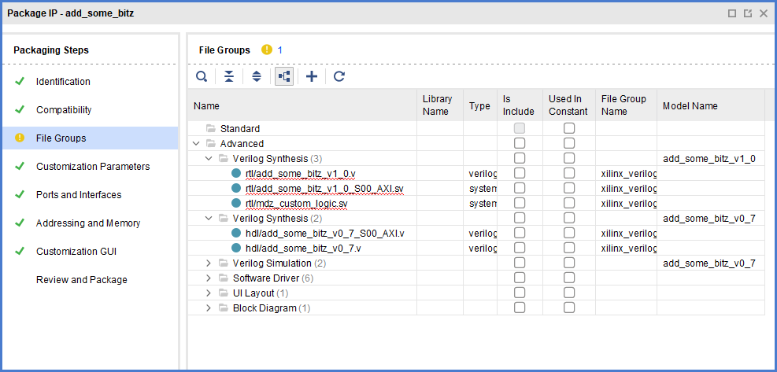
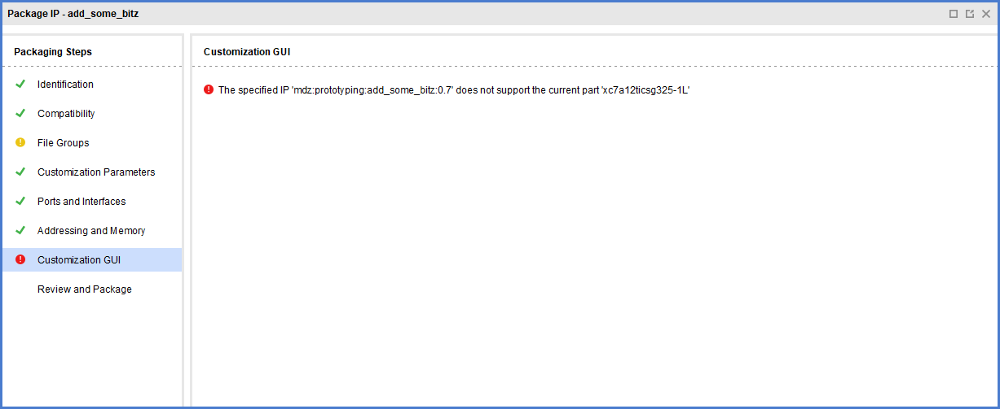

# generate_peripheral
Generate output products for peripheral object.

```
generate_peripheral [‑driver] [‑example_design] [‑bfm_example_design]
                    [‑debug_hw_example_design] [‑enable_interrupt] [‑force] [‑quiet]
                    [‑verbose] <peripheral>
```

| Name                     |  Req / Opt  |        Description        | Notes                      |
|--------------------------|-------------|---------------------------|----------------------------|
| -driver                  |     Opt     | Generate driver for peripheral.                        |
| -example_design          |     Opt     | Generate all supported example designs for peripheral. |
| -bfm_example_design      |     Opt     | Generate bfm simulation example design for peripheral. |
| -debug_hw_example_design |     Opt     | Generate debug hardware example design for peripheral. |
| -enable_interrupt        |     Opt     | Generate peripheral with interrupt suppport.           |
| -force                   |     Opt     | Overwrite the existing IP in the repository.           |
| -quiet                   |     Opt     | Ignore command errors                                  |
| -verbose                 |     Opt     | Suspend message limits during command execution        |
| &lt;peripheral&gt;       |     Req     | peripheral object                                      |

## Abstract
Mistificate the process of assembling a bunch of files by putting them into a black box and adding arbitrary magic, except doing more than this.

Just in case you're wondering no, XAPP1168 does not use this and for good reason (I assumed, but I later discovered more interesting things).

## An attempt at describing the thing
Imagine for a moment your AXI device is ready to go. It comes neatly inside a directory whose structure is kinda like this:
```
your_axi_thing_0.123
|_ bd
|  |_ ...
|_ drivers
|  |_ ...
|_ hdl
|  |_ ...
|_ xgui
|  |_ ...
|_ component.xml 
```

The goal of this command seems to generate the four folders and their contents. This command does **not** generate `component.xml`, that seems to come out of [write_peripheral](./write_peripheral.md).

A reasonable command such as `generate_peripheral -driver $periph` would generate, for our example design:
```
add_some_bitz_0.7
|_ bd
|  |_ bd.tcl
|_ drivers
|  |_ add_some_bitz_v1_0
|     |_ data
|     |  |_ add_some_bitz.mdd
|     |  |_ add_some_bitz.tcl
|     |_ src
|        |_ add_some_bitz.c
|        |_ add_some_bitz.h
|        |_ add_some_bitz_selftest.c
|        |_ Makefile
|_ hdl
|  |_ add_some_bitz_v0_7.v
|  |_ add_some_bitz_v0_7_S00_AXI.v
|_ xgui
|  |_ add_some_bitz_v0_7.tcl
|_ component.xml 
```

The basic form, `generate_peripheral $periph` would not produce the `drivers` subtree.
The cool thing is, this command does not just write to storage as anyone sane would expect. It doesn't even just stop at producing the glue files such as `add_some_bitz_v0_7_S00_AXI.v`, it goes forward and adds stuff to our carefully built peripheral object.

As a start, if you already have the equivalent of `add_some_bitz_v0_7_S00_AXI.v` and `add_some_bitz_v0_7.v` you are screwed: the command doesn't care about it and generates its own way according to magic. 

So, your custom ports? Don't care. HDL parameters? Nope.

If fiddling with files instead of doing interesting work is your thing, you will enjoy there are more details coming. Those two files, as far as I can tell are "constant" in the sense they are meant to provide you with a start canvas where to hook your custom logic.
OFC producing them doesn't make any sense if you have those files already; there's no way to skip this step but in case you're really starting and need those two things you probably want address width to be computed for you.

You might recall from the [typical project-based flow](../typical/README.md) there's a `WIZ_NUM_REG` property to set so if you are a bit more sane than whoever was mentally tortured into giving birth to project-flow, you probably want something like:

```
set_property VALUE 30 [ipx::get_bus_parameters WIZ_NUM_REG -of_objects [ipx::get_bus_interfaces S00_AXI -of_objects $periph]]
```

## On the perils of calling this blindly

I am describing this for the purpose of attempting to understand the mental condition of the poor programmer who was bribed into writing this thing. The cool thing about TCL non-project mode is you're supposed to have control and to me this means having no surprises. 

Let's consider for example a script such as [this](./exploring/generate_peripheral/blindly_generating.tcl). Let's start from the most macro issues. Execute the script and then do this:
```
write_peripheral $periph
start_gui
```
Now, since we started the GUI we can write, in its TCL console,
```
ipx::open_ipxact_file ./add_some_bitz_0.7/component.xml
```
The "usual" Package IP wizard will appear. You probably see there's a yellow exclamation mark on file groups already. Go there and witness this beauty:
.

That's cute enough already but as I fiddled with the button, here's how the customization panel looks like:
.

What happens here is the `generate_peripheral` command will set some fields for you, no questions asked. In particular it enjoys setting the `SUPPORTED_FAMILIES` property. It also blindly adds file groups and the "glue files" [wrapper](./minimal-generation/sources_1/hdl/testAXI1_v1_3.v) and [big mux](./minimal-generation/sources_1/hdl/testAXI1_v1_3_S00_AXI.v).

So, generating a peripheral by means of **the above script is wrong**. Due to the way `generate_peripheral` works we must `create_peripheral` and `generate_peripheral` right away. It seems there is some provision for not overwriting the AXI busses. OFC one would expect those things to be mentioned in UG835 but I guess the notion of documentation is akin to "enjoy repeating yourself".

## The magic files

All things considered, `generate_peripheral` isn't a bad starting point. We can just reuse what it gives us in terms of bus interfaces and file groups, add what we need and be done with it but there's the issue of the Customization GUI tab, which references a unsupported part *xc7a12ticsg325-1L*. From where does that setting come from?

A quick search for *xc7a* in all the files produced no matches.

If you had your go with Vivado and Xilinx long enough you might suspect this might be related to the `part` property which is a project-mode setting but used here. Let me elaborate: running the IP packager GUI is not something we would do regularly but it seems a good way to catch mistakes early as "debugging" the configuration. 

Consider:

> [AR# 54317](https://www.xilinx.com/support/answers/54317.html)
> Even though the Vivado tool is being run in "Non-project" mode, there is a pseudo project being created and used by Vivado. 
> ...
> `set_property part xc7k325tfbg900-2 [current_project]`
> In Vivado 2013.3, the IP association of IP core device and project device will be changed to require the user to issue a command to generate IP core targets in non-project mode. 

Let's do:
```
set outputDir ./pack
file mkdir $outputDir

read_verilog -sv mdz_custom_logic.sv
set periph [ create_peripheral -dir $outputDir {mdz} {prototyping} {add_some_bitz} {0.7} ]
set busAxi [ add_peripheral_interface {S00_AXI} -interface_mode {slave} -axi_type {lite} $periph ]

set_property display_name {add_some_bitz_ABCD} $periph
set_property description {Help me understand the TCL commands mofo} $periph
set_property vendor_display_name {maxdz8} $periph
set_property company_url {http://www.companyurl.eu} $periph
set_property supported_families { {zynq} {Pre-Production} } $periph
```
Now,
```
Vivado% current_project
New Project
Vivado% get_property part [current_project]
xc7a12ticsg325-1L
```

You see, those are all things I would expect to be mentioned in some document involving non-project mode or, the reference, in mulitple places because - why not - maybe it's just me but I doubt anyone can recall those details out of a document counting 1234 pages. But be done with the ranting and just do:

```
generate_peripheral $periph
# Example: Zynq 7020 as on Digilent's Arty Z7-20 (I'm not sure about the speed rating really but I doubt it needs to be accurate)
set_property part {xc7z020clg400-1} [current_project]
write_peripheral $periph
start_gui
```
Now, in the Vivado TCL console,
```
ipx::load_ipxact ./pack/add_some_bitz_0.7/component.xml
```

Go into the *Customization GUI* tab and marvel how everything is ok. Easy, wasn't it? 🤦‍♂️

## A further look at the command fail
Check out this:
```
Vivado% current_project
ERROR: [Coretcl 2-88] No projects are currently open.
Vivado% create_project -part xc7z020clg400-1 -in_memory
Project
```
Note `Project` is different from `New Project` as noted above, yet
```
Vivado% set outputDir ./pack
./pack
Vivado% file mkdir $outputDir
Vivado%
Vivado% read_verilog -sv mdz_custom_logic.sv
c:/vivnonproj/defaults/mdz_custom_logic.sv
Vivado% set periph [ create_peripheral -dir $outputDir {mdz} {prototyping} {add_some_bitz} {0.7} ]
component component_1
Vivado% set busAxi [ add_peripheral_interface {S00_AXI} -interface_mode {slave} -axi_type {lite} $periph ]
INFO: [IP_Flow 19-234] Refreshing IP repositories
INFO: [IP_Flow 19-1704] No user IP repositories specified
INFO: [IP_Flow 19-2313] Loaded Vivado IP repository 'c:/Xilinx/Vivado/2020.2/data/ip'.
bus_interface component_1 S00_AXI
Vivado%
Vivado% set_property display_name {add_some_bitz_ABCD} $periph
Vivado% set_property description {Help me understand the TCL commands mofo} $periph
Vivado% set_property vendor_display_name {maxdz8} $periph
Vivado% set_property company_url {http://www.companyurl.eu} $periph
Vivado% set_property supported_families { {zynq} {Pre-Production} } $periph
Vivado%
Vivado%
Vivado%
Vivado% generate_peripheral $periph
Vivado% write_peripheral $periph
Vivado% start_gui
```
Then, loading the IP packager tabs by `./pack/add_some_bitz_0.7/component.xml` we obtain something looking identical as previous.

So I have pretty much demostrated there requirement of having a *project* (most likely not in the sense of project as in `.xpr` file). 

# TL;DR

1. Call `generate_peripheral` ASAP, it does a lot of work for you.
2. Call `generate_peripheral` ASAP, it doesn't care about data you already entered and might produce inconsistent results. It is much better to re-use what it gives you rather than being "complete". Or, if you really want accuracy, clean its results.
3. After `generate_peripheral` you're supposed to call `write_peripheral` but proper creation requires a project to be created with its `part` property set. Granted, not `gen_periph`'s fault but worth noticing.
