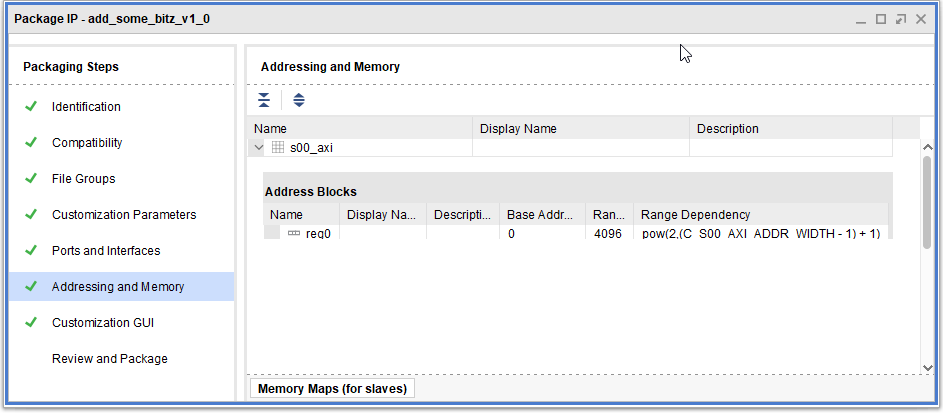

Xilinx XAPP1168 XAPP1168 (v1.0) June 01, 2013
Packaging Custom AXI IP for Vivado IP Integrator

Very promising document failing to deliver. Uses standard GUI-based project mode to pack the current project as AXI IP.

At the end of the day, it's little more than a guide on how to use the "Edit packaged IP" wizard.
A part of the document also covers using the IP in block designs.

If you login into xilinx and download the associated .zip file you will find it has a fairly different structure from expected.

It includes a readme.txt which reads, under "INSTALLATION AND OPERATING INSTRUCTIONS " 

> 1) Install the Xilinx Vivado 2013.1 or later tools.
> 2) From this directory: vivado -source source.tcl

Now, let's execute part of this script and see what happens:

```
Vivado% file mkdir ip_repo
Vivado% create_project package_axi_lite_slave package_axi_lite_slave -part xc7vx485tffg1157-1 -force
WARNING: [Device 21-436] No parts matched 'xc7vx485tffg1157-1'
ERROR: [Coretcl 2-106] Specified part could not be found.

Vivado% add_files -norecurse hdl/verilog/axi_lite_slave.v
c:/xapp1168/hdl/verilog/axi_lite_slave.v
Vivado% import_files -force -norecurse
ERROR: [Common 17-53] User Exception: No open project. Please use Save Project As to save your work and re-do this operation.
```

If that's not enough, you can go forward and you'll see nothing gets produced. No problem: some users on the internet happily declare they made it work by using a proper part so let's modify it a bit and try:

```
Vivado% file mkdir ip_repo
Vivado%
Vivado% create_project package_axi_lite_slave package_axi_lite_slave -part {xc7z020clg400-1} -force -in_memory
package_axi_lite_slave
Vivado% add_files -norecurse hdl/verilog/axi_lite_slave.v
c:/xapp1168/hdl/verilog/axi_lite_slave.v
Vivado% import_files -force -norecurse
ERROR: [Common 17-53] User Exception: No open project. Please use Save Project As to save your work and re-do this operation.


Vivado%
```
OFC using an in-memory project is a bad idea. It's really based on `.xpr` file so it is true project mode, the idea scares the 💩 out of me. Project mode gave me so much pain I'd wouldn't touch it with a ten-foot pole but since there's no chance let's something more conventional, just changing the part.

```
Vivado% file mkdir ip_repo
Vivado%
Vivado% create_project package_axi_lite_slave package_axi_lite_slave -part {xc7z020clg400-1} -force
package_axi_lite_slave
Vivado% add_files -norecurse hdl/verilog/axi_lite_slave.v
c:/xapp1168/hdl/verilog/axi_lite_slave.v
Vivado% import_files -force -norecurse
INFO: [filemgmt 20-348] Importing the appropriate files for fileset: 'sources_1'
c:/xapp1168/package_axi_lite_slave/package_axi_lite_slave.srcs/sources_1/imports/verilog/axi_lite_slave.v
Vivado% update_compile_order -fileset sources_1
Vivado% update_compile_order -fileset sim_1
Vivado% ipx::package_project
INFO: [IP_Flow 19-1976] HDL Parser: Replacing 'ADDR_MSB' by 5 for port or parameter 'axi_awaddr'
INFO: [IP_Flow 19-1976] HDL Parser: Replacing 'ADDR_MSB' by 5 for port or parameter 'axi_araddr'
INFO: [IP_Flow 19-234] Refreshing IP repositories
INFO: [IP_Flow 19-1704] No user IP repositories specified
INFO: [IP_Flow 19-2313] Loaded Vivado IP repository 'c:/Xilinx/Vivado/2020.2/data/ip'.
INFO: [IP_Flow 19-5107] Inferred bus interface 'S_AXI' of definition 'xilinx.com:interface:aximm:1.0' (from Xilinx Repository).
INFO: [IP_Flow 19-5107] Inferred bus interface 'S_AXI_ARESETN' of definition 'xilinx.com:signal:reset:1.0' (from Xilinx Repository).
INFO: [IP_Flow 19-5107] Inferred bus interface 'S_AXI_ACLK' of definition 'xilinx.com:signal:clock:1.0' (from Xilinx Repository).
INFO: [IP_Flow 19-4728] Bus Interface 'S_AXI_ARESETN': Added interface parameter 'POLARITY' with value 'ACTIVE_LOW'.
INFO: [IP_Flow 19-4728] Bus Interface 'S_AXI_ACLK': Added interface parameter 'ASSOCIATED_BUSIF' with value 'S_AXI'.
INFO: [IP_Flow 19-4728] Bus Interface 'S_AXI_ACLK': Added interface parameter 'ASSOCIATED_RESET' with value 'S_AXI_ARESETN'.
INFO: [IP_Flow 19-2181] Payment Required is not set for this core.
INFO: [IP_Flow 19-2187] The Product Guide file is missing.
component component_1
Vivado% set_property library {user} [ipx::current_core]
Vivado% set_property vendor_display_name {YourCompanyName} [ipx::current_core]
Vivado% set_property company_url {www.YourCompanyName.com} [ipx::current_core]
Vivado% set_property company_url {http://www.YourCompanyName.com} [ipx::current_core]
Vivado% set_property vendor {YourCompanyName.com} [ipx::current_core]
Vivado% set_property supported_families {{zynq} {Pre-Production}} [ipx::current_core]
Vivado% set_property taxonomy {{/Embedded_Processing/AXI_Infrastructure}} [ipx::current_core]
Vivado% ipx::check_integrity [ipx::current_core]
INFO: [IP_Flow 19-2181] Payment Required is not set for this core.
INFO: [IP_Flow 19-2187] The Product Guide file is missing.
INFO: [Ipptcl 7-1486] check_integrity: Integrity check passed.
1
Vivado% ipx::archive_core {ip_repo/YourCompanyName.com_user_axi_lite_slave_1.0.zip} [ipx::current_core]
3
Vivado% close_project
```

A few cons:
1. Creating the project to disk will generate a `package_axi_lite_slave` folder, there are some files inside, including the dreaded `.xpr` thing. Immediately after `create_project` it references no files.
2. It's noisy. And it copies files around.
3. There is a lot of magic and inference, little control which I find against the notion of TCL mode but...
4. When `ipx::package_project` is run, we can find our component (axi IP being created) into `./package_axi_lite_slave\package_axi_lite_slave.srcs\sources_1\imports`. The `component.xml` can be found there and uses relative paths as expected but there are no `.c` driver files. The `.xpr` file has been updated to refer to `axi_lite_slave.v`.
5. The `.zip` file produced by `ipx::archive_core` (most likely just a copy of the component directory) is very minimalistic, most likely broken as
    1. There are no drivers generated, maybe they'll generate them later, IDK but go on
    2. The GUI is extremely minimal; the AXI lite slave includes no parameters.
6. Closing the project leaves the directory and temporary files floating around (so, no GIT anyway, but we could at least ignore it, I admit)

All things considered, I think we can live with all the above; the AXI slave example is just too minimal. How does it fare with something I consider more sane such as the example project I'm working on? Let's try [this script](./quick_n_dirty.tcl):

```
Vivado% file mkdir ip_repo
Vivado%
Vivado% create_project -part {xc7z020clg400-1} -force dummyProjectName garbageDir
dummyProjectName
Vivado% add_files -norecurse {
    rtl/add_some_bitz_v1_0.v
    rtl/add_some_bitz_v1_0_S00_AXI.sv
    rtl/mdz_custom_logic.sv
}
c:/xapp1168/rtl/add_some_bitz_v1_0.v c:/xapp1168/rtl/add_some_bitz_v1_0_S00_AXI.sv c:/xapp1168/rtl/mdz_custom_logic.sv
Vivado%
Vivado%
Vivado%
Vivado%
Vivado% import_files -force -norecurse
INFO: [filemgmt 20-348] Importing the appropriate files for fileset: 'sources_1'
c:/xapp1168/garbageDir/dummyProjectName.srcs/sources_1/imports/rtl/add_some_bitz_v1_0.v c:/xapp1168/garbageDir/dummyProjectName.srcs/sources_1/imports/rtl/add_some_bitz_v1_0_S00_AXI.sv c:/xapp1168/garbageDir/dummyProjectName.srcs/sources_1/imports/rtl/mdz_custom_logic.sv
Vivado% update_compile_order -fileset sources_1
Vivado% update_compile_order -fileset sim_1
Vivado% ipx::package_project
INFO: [IP_Flow 19-5654] Module 'add_some_bitz_v1_0' uses SystemVerilog sources with a Verilog top file. These SystemVerilog files will not be analysed by the packager.
INFO: [IP_Flow 19-234] Refreshing IP repositories
INFO: [IP_Flow 19-1704] No user IP repositories specified
INFO: [IP_Flow 19-2313] Loaded Vivado IP repository 'c:/Xilinx/Vivado/2020.2/data/ip'.
INFO: [IP_Flow 19-5107] Inferred bus interface 's00_axi' of definition 'xilinx.com:interface:aximm:1.0' (from Xilinx Repository).
INFO: [IP_Flow 19-5107] Inferred bus interface 's00_axi_aresetn' of definition 'xilinx.com:signal:reset:1.0' (from Xilinx Repository).
INFO: [IP_Flow 19-5107] Inferred bus interface 's00_axi_aclk' of definition 'xilinx.com:signal:clock:1.0' (from Xilinx Repository).
INFO: [IP_Flow 19-4728] Bus Interface 's00_axi_aresetn': Added interface parameter 'POLARITY' with value 'ACTIVE_LOW'.
INFO: [IP_Flow 19-4728] Bus Interface 's00_axi_aclk': Added interface parameter 'ASSOCIATED_BUSIF' with value 's00_axi'.
INFO: [IP_Flow 19-4728] Bus Interface 's00_axi_aclk': Added interface parameter 'ASSOCIATED_RESET' with value 's00_axi_aresetn'.
INFO: [IP_Flow 19-2181] Payment Required is not set for this core.
INFO: [IP_Flow 19-2187] The Product Guide file is missing.
component component_1
Vivado% set_property library {user} [ipx::current_core]
Vivado% set_property vendor_display_name {YourCompanyName} [ipx::current_core]
Vivado% set_property company_url {www.YourCompanyName.com} [ipx::current_core]
Vivado% set_property company_url {http://www.YourCompanyName.com} [ipx::current_core]
Vivado% set_property vendor {YourCompanyName.com} [ipx::current_core]
Vivado% set_property supported_families {{zynq} {Pre-Production}} [ipx::current_core]
Vivado% set_property taxonomy {{/Embedded_Processing/AXI_Infrastructure}} [ipx::current_core]
Vivado% ipx::check_integrity [ipx::current_core]
INFO: [IP_Flow 19-2181] Payment Required is not set for this core.
INFO: [IP_Flow 19-2187] The Product Guide file is missing.
INFO: [Ipptcl 7-1486] check_integrity: Integrity check passed.
1
Vivado% ipx::archive_core {ip_repo/YourCompanyName.com_example_thing.zip} [ipx::current_core]
5
Vivado% close_project
```

1. Albeit no parameters have been inferred, the GUI TCL script contains them. I assume you might consider customizing them here but I'd rather have them controlled by script.
2. `component.xml` contains port information.
3. No drivers have been generated.

Instead of archiving the core, I `start_gui`. The Flow navigator has the *Edit Packaged IP* button as we would expect. Addressing looks weird and at least certainly different:


Adding a software driver file group produces the following message (I can't find it in the TCL console nor the Log):

> [IP_Flow 19-4629] File Group 'xilinx_softwaredriver (Software Driver)': Requires either a MLD or a MDD file for Vivado SDK.  Neither have been added to file group: "xilinx_softwaredriver"
Resolution: Add an MLD or MDD file for Vivado SDK support.

The XAPP1168 method is very tempting for the effort involved. You can cobble up something in less than an hour and be running. Generating output products in a later stage also seems a promising possibility, and it is a great starting point but...

I am looking at a more robust, less magical solution. I will invest more time if necessary, but I don't want to be this leaky.
For example, TCL script can instrument the GUI to provide accurate parameter selections. I want my components to be very close, ideally indistinguishable from the ones produced by graphical means, because **those are known to work**.

Besides, no drivers, no fun.
