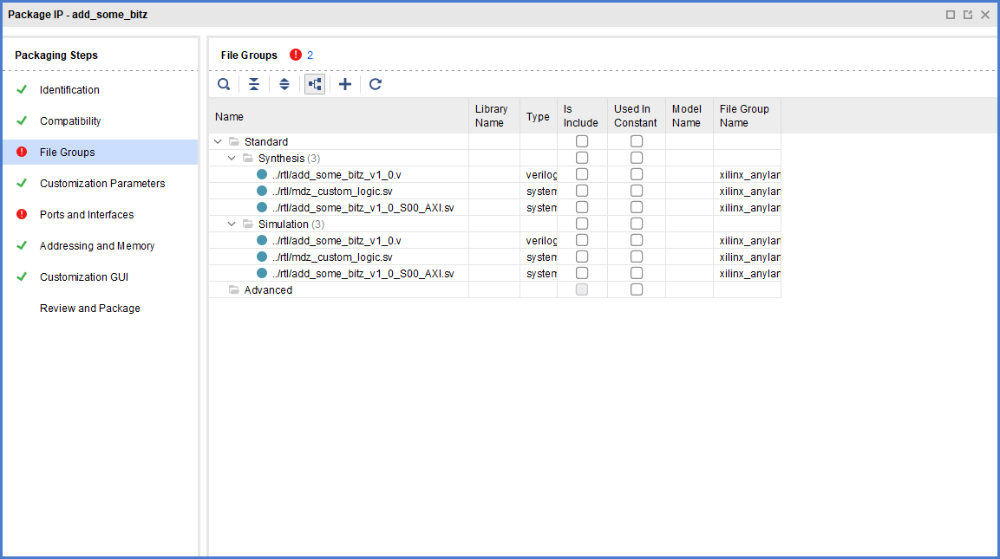
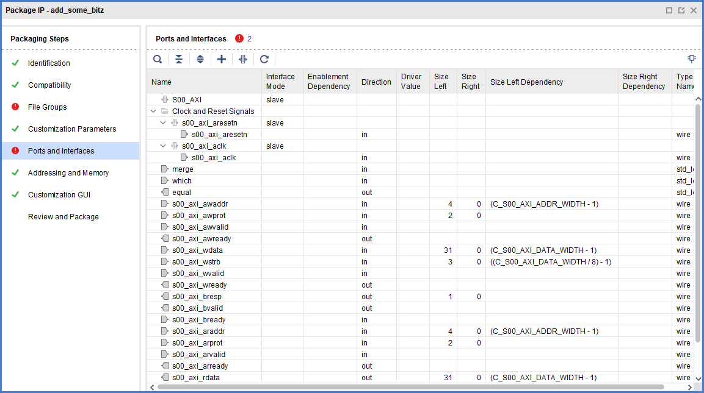
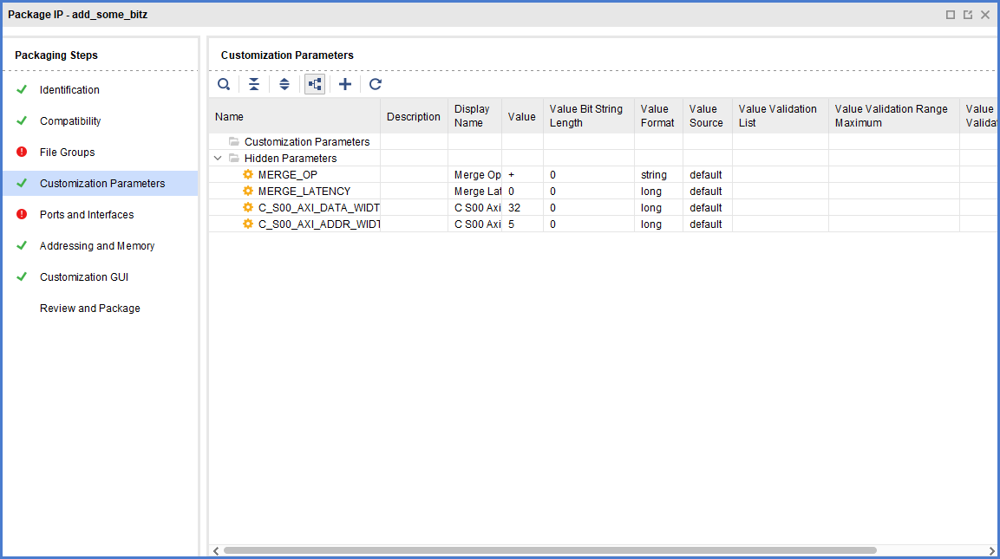

**This does not work**, it is reported for documentation purposes. **Don't do that**, it just doesn't work!

Consider a [minimalistic creation](./minimalistic_incomplete.tcl) using `ipx::merge_project_changes hdl_parameters`.
This isn't quite what UG835 suggests in the examples but hey, given the situation with the documentation what can possibly go worse?

I think it is worth examining the results of the merge command:
```
Vivado% ipx::merge_project_changes hdl_parameters $periph
WARNING: [IP_Flow 19-5101] Packaging a component with a SystemVerilog top file is not fully supported. Please refer to UG1118 'Creating and Packaging Custom IP'.
INFO: [IP_Flow 19-5107] Inferred bus interface 's00_axi_aresetn' of definition 'xilinx.com:signal:reset:1.0' (from Xilinx Repository).
INFO: [IP_Flow 19-5107] Inferred bus interface 's00_axi_aclk' of definition 'xilinx.com:signal:clock:1.0' (from Xilinx Repository).
INFO: [IP_Flow 19-4728] Bus Interface 's00_axi_aresetn': Added interface parameter 'POLARITY' with value 'ACTIVE_LOW'.
INFO: [IP_Flow 19-4728] Bus Interface 's00_axi_aclk': Added interface parameter 'ASSOCIATED_BUSIF' with value 'S00_AXI'.
INFO: [IP_Flow 19-4728] Bus Interface 's00_axi_aclk': Added interface parameter 'ASSOCIATED_RESET' with value 's00_axi_aresetn'.
1
```

Let's `write_peripheral` and `start_gui`. Then, in Vivado's graphical TCL console let's examine the results by `ipx::open_ipxact_file ./_tmp_packing/component.xml`. Four errors are reported.


The errors reported are:
- (Twice) [IP_Flow 19-407] File Group 'xilinx_anylanguagebehavioralsimulation (Simulation)': Missing top model name.

Warnings are rather nice as well:
- (5x) [IP_Flow 19-5905] All packaged files should be located below the IP definition file (xml)

Lovely. I also need to note GUI-generated device components don't use those groups but rather their "Advanced" variations (see [canon](../typical\canon\03_device_customization\17_epip_03_file_groups.png)).

The situation gets even ~~better~~ worse with the ports and interfaces, the ports have not been grouped together:
.

That's rather obvious given the reported error first error in particular:
- [IP_Flow 19-1789] Bus Interface 'S00_AXI': Bus interface "S00_AXI" does not contain any port map.
- [IP_Flow 19-3255] Bus Interface 'S00_AXI': The slave AXIMM interface requires port maps to the read or write channel signals.

All things considered, this is kinda justified since port maps put ports into bus interfaces.

It turns out customization parameters are fairly borked as well. While our `MERGE_OP` and  `MERGE_LATENCY` appear to have been parsed nicely, AXI parameters got the short end of the stick.


Addressing and memory seems to present an incomplete IP Memory Map; the address block is incomplete as well and no address block parameters exist.

OFC the GUI doesn't exist as `generate_peripheral` was not called; in those conditions `ipx::create_xgui_files` has an hard time.

I will spare you the eyecandy.

Possible exploration paths:
1. What happens if I [explicitly provide port maps for AXI](../02-providing-axi-map/README.md)?
2. Mish-mash with `generate_peripheral` as suggested by UG835? Did that already, fairly noisy and quite some caveats.

<span style='font-size:200%'>💩</span>