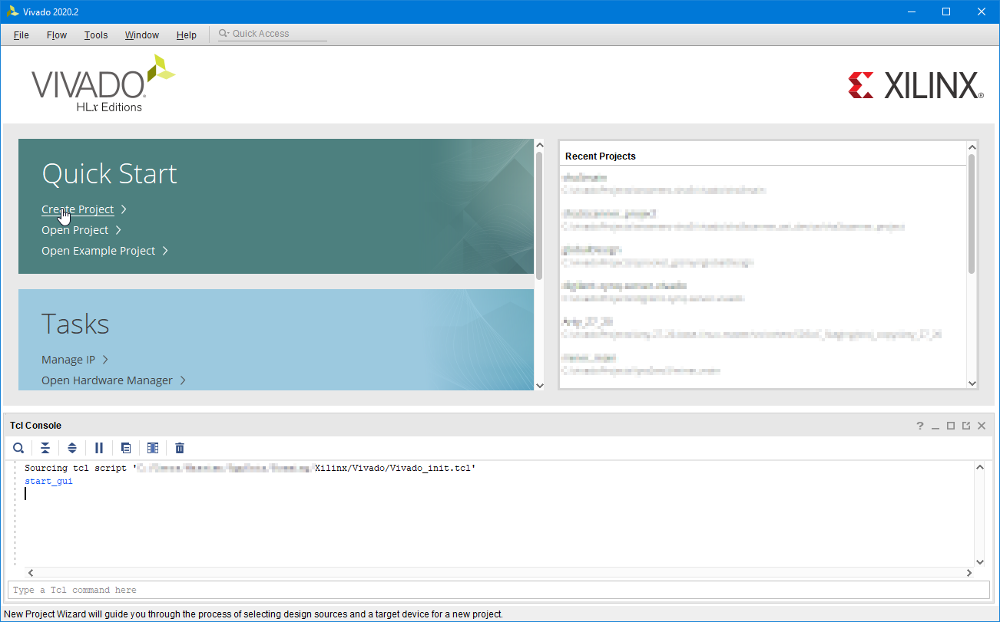

How to create an AXI IP?
There are various ways. In this case I will be creating it "as needed", being part of another design.
There are other methods but I suspect this to be the easiest, at least for beginners as it naturally creates a project with "Edit IP" in the flow navigator.

# Main project creation

Next panel is "Project name". I usually go by "main", put it in a directory where you can conveniently locate the side-project as well (it's supposed to be temporary but it'll leak into existance very often in my experience).

Next panel is "Project type"; we all have seen this in Xilinx flow documentation so many times.

Then I select the "Default part". This concept is related to projects. It can go by chips or by boards, I usually prefer the latter.

Last wizard panel.

This section is provided for completeness and document the process but it's not considered relevant so no TCL commands are reported.
