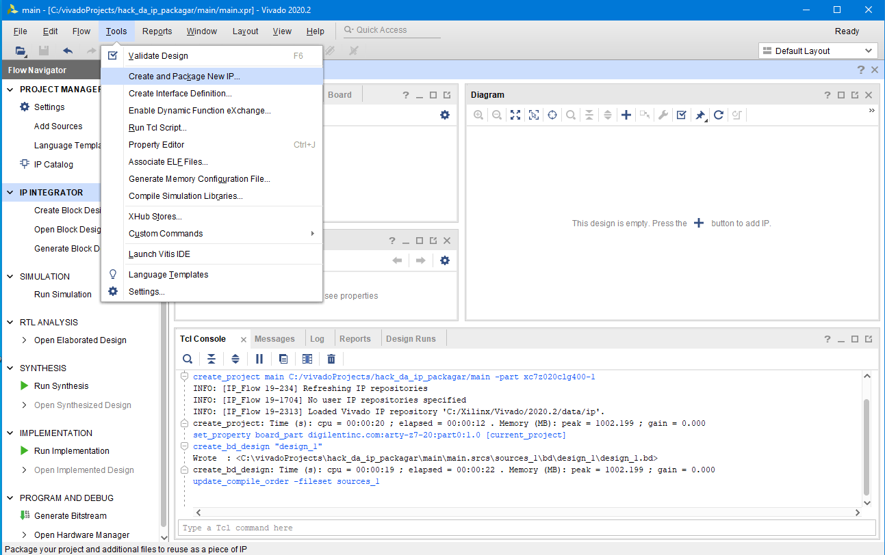

After main project creation, how to create an AXI device by the book?

AXI devices (components) are part of "block designs" and "IP". So let's start by creating a block design.


It is possible to create an AXI Device in various modes, but they all start from menu Tools > Create and package new IP.


First wizard panel is useless. Just click Next.


I usually go by *Create AXI4 Peripheral*, it seems to me that would be option giving best control.


Initial peripheral details. This is were things start to go awry. We might thing display name is just a presentation gimmick but we'll later see it has consequences. More informations can be provided later.


In the fourth panel I change the number of registers to `7`. I would expect this to be a very basic requirement.
Note I will be going with AXI Lite.


In the last panel I go with "Edit IP".


Clicking the *Finish* button will start magic. The TCL console will dump:
```
create_peripheral xilinx.com user add_some_bitz 0.1 -dir C:/vivadoProjects/hack_da_ip_packagar/main/../ip_repo
add_peripheral_interface S00_AXI -interface_mode slave -axi_type lite [ipx::find_open_core xilinx.com:user:add_some_bitz:0.1]
set_property VALUE 7 [ipx::get_bus_parameters WIZ_NUM_REG -of_objects [ipx::get_bus_interfaces S00_AXI -of_objects [ipx::find_open_core xilinx.com:user:add_some_bitz:0.1]]]
generate_peripheral -driver -bfm_example_design -debug_hw_example_design [ipx::find_open_core xilinx.com:user:add_some_bitz:0.1]
write_peripheral [ipx::find_open_core xilinx.com:user:add_some_bitz:0.1]
set_property  ip_repo_paths  C:/vivadoProjects/hack_da_ip_packagar/main/../ip_repo/add_some_bitz_0.1 [current_project]
update_ip_catalog -rebuild
INFO: [IP_Flow 19-234] Refreshing IP repositories
INFO: [IP_Flow 19-1700] Loaded user IP repository 'c:/vivadoProjects/hack_da_ip_packagar/ip_repo/add_some_bitz_0.1'.
ipx::edit_ip_in_project -upgrade true -name edit_add_some_bitz_v0_1 -directory C:/vivadoProjects/hack_da_ip_packagar/main/../ip_repo c:/vivadoProjects/hack_da_ip_packagar/ip_repo/add_some_bitz_0.1/component.xml
INFO: [IP_Flow 19-234] Refreshing IP repositories
INFO: [IP_Flow 19-1704] No user IP repositories specified
INFO: [IP_Flow 19-2313] Loaded Vivado IP repository 'C:/Xilinx/Vivado/2020.2/data/ip'.
create_project: Time (s): cpu = 00:00:17 ; elapsed = 00:00:11 . Memory (MB): peak = 1002.199 ; gain = 0.000
INFO: [IP_Flow 19-234] Refreshing IP repositories
INFO: [IP_Flow 19-1700] Loaded user IP repository 'c:/vivadoProjects/hack_da_ip_packagar/ip_repo/add_some_bitz_0.1'.
INFO: [IP_Flow 19-795] Syncing license key meta-data
ipx::edit_ip_in_project: Time (s): cpu = 00:00:23 ; elapsed = 00:00:15 . Memory (MB): peak = 1002.199 ; gain = 0.000
update_compile_order -fileset sources_1
```

The following files will be created:
```
[hack_da_ip_packagar\ip_repo](./initial_component)
│   edit_add_some_bitz_v0_1.xpr
│
├───add_some_bitz_0.1
│   │   component.xml
│   │
│   ├───bd
│   │       bd.tcl
│   │
│   ├───drivers
│   │   └───add_some_bitz_v1_0
│   │       ├───data
│   │       │       add_some_bitz.mdd
│   │       │       add_some_bitz.tcl
│   │       │
│   │       └───src
│   │               add_some_bitz.c
│   │               add_some_bitz.h
│   │               add_some_bitz_selftest.c
│   │               Makefile
│   │
│   ├───example_designs
│   │   ├───bfm_design
│   │   │       add_some_bitz_v0_1_tb.sv
│   │   │       design.tcl
│   │   │
│   │   └───debug_hw_design
│   │           add_some_bitz_v0_1_hw_test.tcl
│   │           design.tcl
│   │
│   ├───hdl
│   │       add_some_bitz_v0_1.v
│   │       add_some_bitz_v0_1_S00_AXI.v
│   │
│   └───xgui
│           add_some_bitz_v0_1.tcl
│
├───edit_add_some_bitz_v0_1.cache
│   └───wt
│           project.wpc
│
├───edit_add_some_bitz_v0_1.hw
│       edit_add_some_bitz_v0_1.lpr
│
├───edit_add_some_bitz_v0_1.ip_user_files
└───edit_add_some_bitz_v0_1.sim
```

A new Vivado window will pop, dealing with the newly created project. I call this the *device project* window.
Let's forget about the main project for now - keep it in background.
If you close the device project window at this point all those things will most likely disappear. Albeit those files can be trivially reproduced, I have kept a [snapshot](./initial_component).
