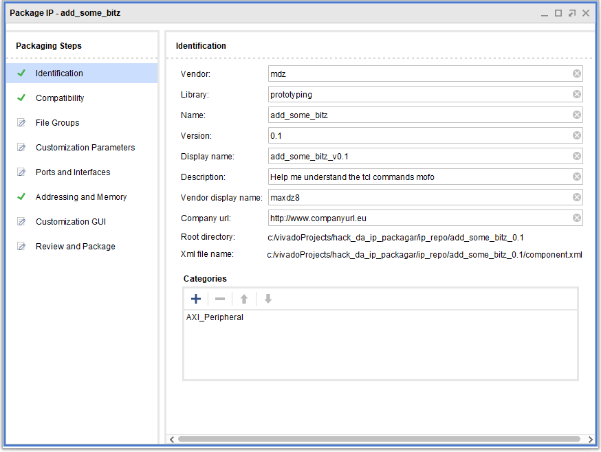
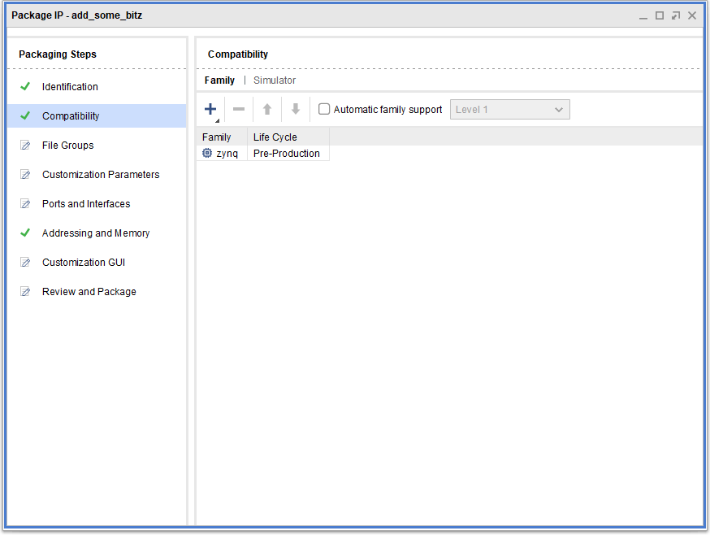
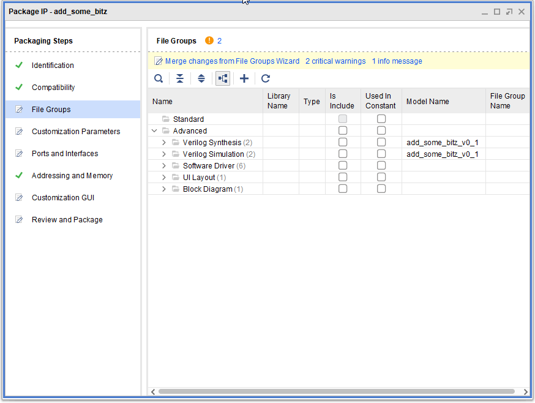
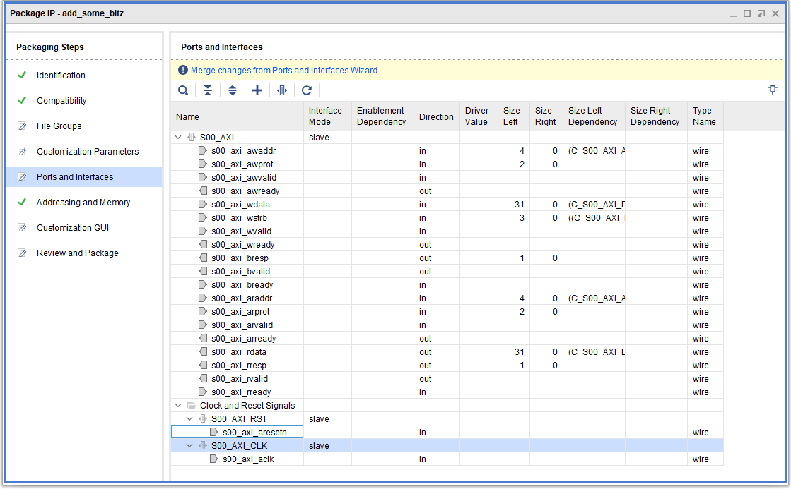
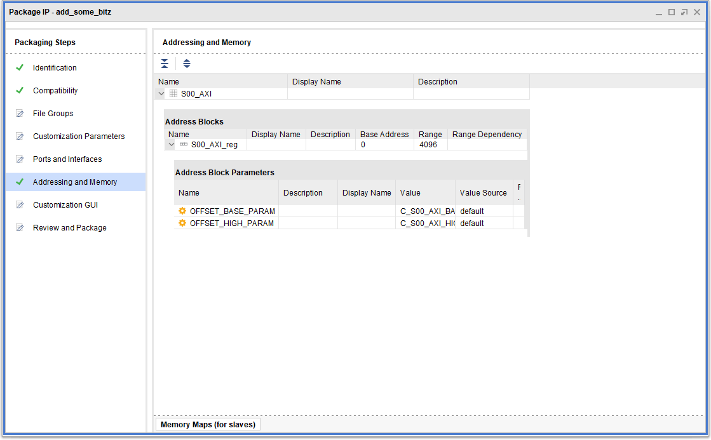
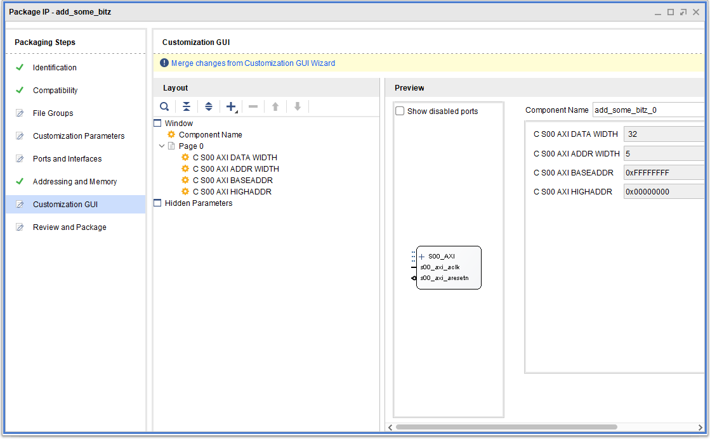
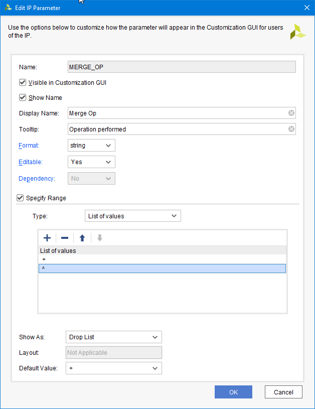
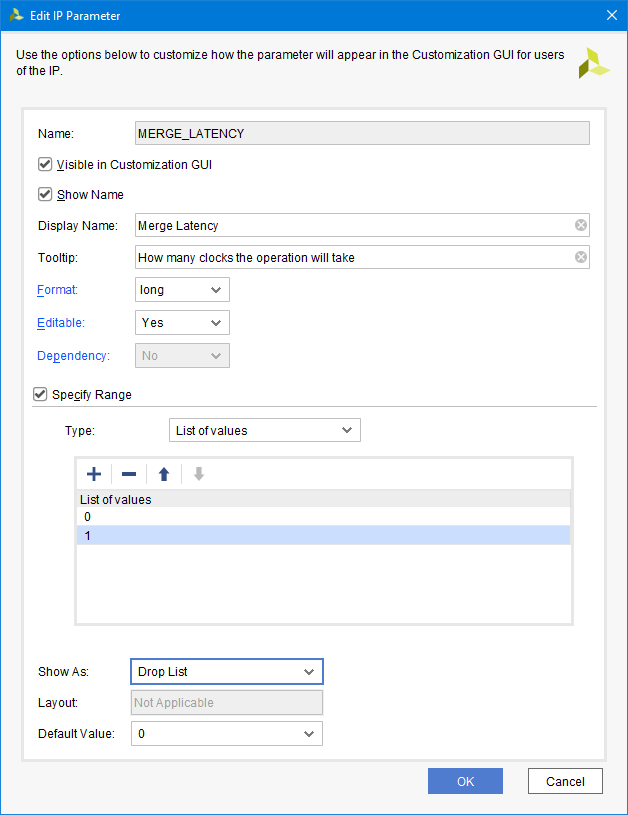

The device template source provided by Vivado doesn't do much - it just writes and reads the registers we asked for.
It has marked zones where we are expected to make our modifications.

# Modifying the sources

I want my files to be [like this](../../rtl) instead of those [provided by default](../02_device_creation/initial_component/add_some_bitz_0.1/hdl).

The main differences are
1. I want SystemVerilog as my language of choice. AXI devices MUST have a top module written in standard Verilog but I can change the other file.
2. I want to demostrate some (simple) extra ports.
3. I want to demostrate some (simple) extra parameters.

I will only describe the process instead of providing screenshots.
1. Overwrite the top module (file: `add_some_bitz_v0_1.v`) with this [../../rtl/add_some_bitz_v1_0.v] (not quite: I have goofed up with the file versions, be careful to adjust module naming). This is the *top module*
2. **Copy** [this file](../../rtl/add_some_bitz_v1_0_S00_AXI.sv) near `add_some_bitz_v1_0_S00_AXI.sv` (again, excuse me for the module naming)
3. In Vivado, go in the Sources panel, Hierarchy tab. Right-click on the instantiated module (`add_some_bitz_v1_0_S00_AXI_inst`) then select *Replace file*
4. Switch to Files of Type "All files" then locate and the new SystemVerilog file. 
5. In Vivado, go in the Source File Properties, for `add_some_bitz_v1_0_S00_AXI.sv`: it has triggered some syntax error as it remained in Verilog mode; set its `Type` to *SystemVerilog*.
6. Note in the hierarchy, a red question mark "gizmo" now appears.
7. Delete `add_some_bitz_v0_1_S00_AXI.v`
8. Copy [`mdz_custom_logic.sv`](../../rtl/mdz_custom_logic.sv) in the same folder as `add_some_bitz_v1_0_S00_AXI.sv`
9. IN Vivado, in the Sources panel, push +
10. Add Or create design sources, next. Add files. Select `mdz_custom_logic.sv`. Finish.

Let's clear the TCL console now as we're going to export.

In the *Flow navigator*, click *Edit packaged IP*.

# State of things for the packaged IP

In the first panel, modify data as follows:


Note the state of other tabs. Only *Compatibility* and *Addressing and memory* have green ✔; the others have an "edit" icon.

Leave the second panel as is.


Not very useful but let's document the state of the *File Groups* panel. Note the proposed action *Merge changes from File Groups Wizard*.


*Ports and interfaces*, hierarcical, unfolded visualization. Note the proposed action *Merge changes from Ports and Interfaces Wizard*.


*Addressing and memory*, nothing to do here.


The *Customization GUI* panel also proposed a similar *Merge changes from Customization GUI Wizard*.


Let's ignore the last tab for now.

# Merging the changes

Go back to the *File Groups* tab. Clear the TCL console if you haven't done it yet.
Click *Merge changes &hellip;*.

Note the following output in the console:
```
ipx::merge_project_changes files [ipx::current_core]
WARNING: [IP_Flow 19-5226] Project source file 'c:/vivadoProjects/hack_da_ip_packagar/ip_repo/add_some_bitz_0.1/component.xml' ignored by IP packager.
WARNING: [IP_Flow 19-5109] File Group 'xilinx_verilogsynthesis (Verilog Synthesis)': File 'c:/vivadoProjects/hack_da_ip_packagar/ip_repo/add_some_bitz_0.1/hdl/add_some_bitz_v0_1_S00_AXI.v' does not exist in the project sources. It has been removed from the packaged IP. If still required, please add this file to the project, merge sources and re-package.
WARNING: [IP_Flow 19-5109] File Group 'xilinx_verilogbehavioralsimulation (Verilog Simulation)': File 'c:/vivadoProjects/hack_da_ip_packagar/ip_repo/add_some_bitz_0.1/hdl/add_some_bitz_v0_1_S00_AXI.v' does not exist in the project sources. It has been removed from the packaged IP. If still required, please add this file to the project, merge sources and re-package.
```

As it stands now the result doesn't look quite right to me. We put the file `mdz_custom_logic.sv` and it now got copied to another folder. Let's ignore this for now.

Merge changes in *Customization parameters* as well. This is more interesting.
Note the output in the console:
```
ipx::merge_project_changes hdl_parameters [ipx::current_core]
WARNING: [IP_Flow 19-5226] Project source file 'c:/vivadoProjects/hack_da_ip_packagar/ip_repo/add_some_bitz_0.1/component.xml' ignored by IP packager.
INFO: [IP_Flow 19-5654] Module 'add_some_bitz_v0_1' uses SystemVerilog sources with a Verilog top file. These SystemVerilog files will not be analysed by the packager.
INFO: [IP_Flow 19-3166] Bus Interface 'S00_AXI': References existing memory map 'S00_AXI'.
```

The new state of the panel is as follows:


Note all panels except *Review and package* have green ✔ now.

# Better HDL parameters

> Let me clarify, parameters have caused immense pain. The initial plan was to generate everything by explicit TCL but as the experiment progressed, I had to reconsider my attitude.

Note:
- In the Customization Parameters tab, if you right-click an hidden parameter and selecting from the context menu *Edit Parameter&hellip;*
- gets you the same dialog as doing the same from the Custemization GUI tab.

> There's an obvious correlation between parameters and their GUI representation but I have reason to believe the relationship runs much deeper.

We want the user of our IP to use it as a black box; provide a level of abstraction. There must be obviously no need to go look at the internal source, and this means the parameter GUI must (ideally) be constructed in a way no invalid configuration can occur or at least we don't need to crack our heads open to figure out valid values.

Let's set up both parameters.

## MERGE_OP

Must be visible in customization GUI.
Supported values are `+` and `^`.



Clicking OK will result in the emission of this TCL:
```
set_property value_validation_type list [ipx::get_user_parameters MERGE_OP -of_objects [ipx::current_core]]
set_property value_validation_list {+ ^} [ipx::get_user_parameters MERGE_OP -of_objects [ipx::current_core]]
ipgui::add_param -name {MERGE_OP} -component [ipx::current_core] -display_name {Merge Op} -show_label {true} -show_range {true} -widget {comboBox}
set_property tooltip {Operation performed} [ipgui::get_guiparamspec -name "MERGE_OP" -component [ipx::current_core] ]
```

> So far so good. I was up to this point. You probably think calling `ipgui::add_param` to be just enough but a surprise is lurking here, mind you. Hopefully we'll be back there at some point.

## MERGE_LATENCY

Must be visible in customization GUI.
From implementation we can asses valid values are: 0, 1.
Can it be a bit? I'm just happier with `long`.



Note the "Show as" combobox contains the following options:
- Drop list
- Radio group
- Check box (love those booleans don't you?)

Clicking OK will result in the emission of the following TCL:
```
ipgui::add_param -name {MERGE_LATENCY} -component [ipx::current_core] -display_name {Merge Latency} -show_label {true} -show_range {true} -widget {comboBox}
set_property tooltip {How many clocks the operation will take} [ipgui::get_guiparamspec -name "MERGE_LATENCY" -component [ipx::current_core] ]
```

# A glimpse into abyss

There must be something going on with 'gui param specs' and `ipgui::get_guiparamspec` might well be the cornerstone. If you just call `ipgui::add_param` in your script you might get somethig like this:

```
ipgui::add_param -name {MERGE_OP} -component $periph -display_name {Merge Operation} -show_label {true} -show_range {true} -widget {comboBox}
# Vivado% ipgui::add_param -name {MERGE_OP} -component $periph -display_name {Merge Operation} -show_label {true} -show_range {true} -widget {comboBox}
# WARNING: [IP_Flow 19-469] Gui parameter('MERGE_OP') creation is incomplete. Corresponding component parameter does not exist
# MERGE_OP
```

Albeit not shown in Vivado TCL console, something must be creating the missing structure. OFC we have no real clue what we're talking about from the informative messages (as usual, I might add) and surely, the exact meaning of IP_Flow 19-469 is surely a trade secret and technology advantage. Please check your favourite search engines for *any* info.

# Packaging and using

Just a matter of hitting the "Package IP button". The following dialog asks if to close the project. Yes.

We are back in the main project.

Convince yourself the component works by fiddling a bit with the block design.

I went ahead and generated output products, synthetized, and PAR-d, inspected the logic and yes, stuff is here.

For the time being, I will not cover this. The focus is to better understand how to produce a packaged IP with no GUI and without project mode.
