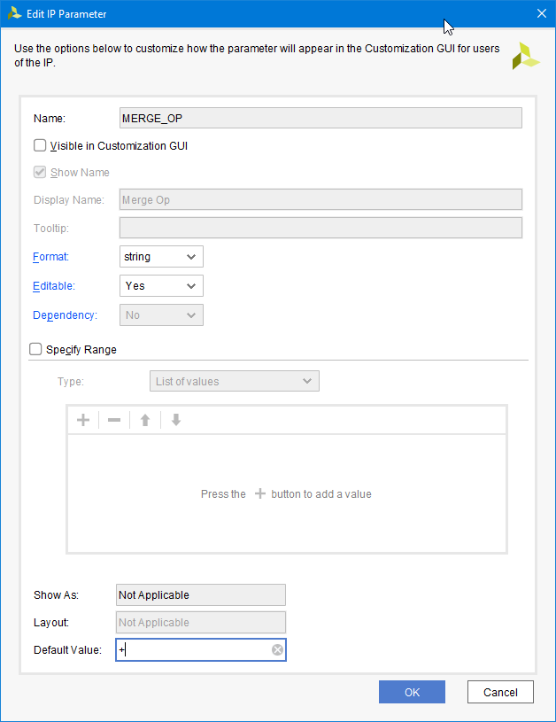

# Customization Parameters


Let's check out part of the initial state, as produced by the template.

```
ipx::get_hdl_parameters
hdl_parameter component_3 C_S00_AXI_DATA_WIDTH hdl_parameter component_3 C_S00_AXI_ADDR_WIDTH
list_property [lindex [ipx::get_hdl_parameters] 0]
CLASS CONFIG_GROUPS DATA_TYPE DESCRIPTION DISPLAY_NAME ENABLEMENT_DEPENDENCY ENABLEMENT_PRESENCE ENABLEMENT_RESOLVE_TYPE ENABLEMENT_TCL_EXPR ENABLEMENT_TCL_EXPR_ARGUMENTS ENABLEMENT_VALUE IPXACT_ID NAME ORDER PARAMETER_TYPES USAGE VALUE VALUE_BIT_STRING_LENGTH VALUE_DEPENDENCY VALUE_FORMAT VALUE_RESOLVE_TYPE VALUE_SOURCE VALUE_TCL_EXPR VALUE_TCL_EXPR_ARGUMENTS VALUE_VALIDATION_LIST VALUE_VALIDATION_PAIRS VALUE_VALIDATION_RANGE_MAXIMUM VALUE_VALIDATION_RANGE_MINIMUM VALUE_VALIDATION_TYPE
```

I have used the "Merge changes from Customization Parameters Wizard" to check how parameters are supposed to be set up. The list is now:
```
ipx::get_hdl_parameters
hdl_parameter component_1 C_S00_AXI_DATA_WIDTH hdl_parameter component_1 C_S00_AXI_ADDR_WIDTH hdl_parameter component_1 MERGE_OP hdl_parameter component_1 MERGE_LATENCY
```
Note `C_S00_AXI_BASEADDR` and `C_S00_AXI_HIGHADDR` are are shown in the table even though they are not reported here. They are indeed a different kind of parameters, look for them in [Addressing and Memory](./addressing_and_memory.md).

Let's investigate those values by getting each property.
| CLASS                          | hdl_parameter       |
| CONFIG_GROUPS                  |                     |
| DATA_TYPE                      | integer             |
| DESCRIPTION                    | Width of S_AXI data bus |
| DISPLAY_NAME                   | C S00 AXI DATA WIDTH |
| ENABLEMENT_DEPENDENCY          |                     |
| ENABLEMENT_PRESENCE            | optional            |
| ENABLEMENT_RESOLVE_TYPE        | immediate           |
| ENABLEMENT_TCL_EXPR            |                     |
| ENABLEMENT_TCL_EXPR_ARGUMENTS  |                     |
| ENABLEMENT_VALUE               | 1                   |
| IPXACT_ID                      | MODELPARAM_VALUE.C_S00_AXI_DATA_WIDTH |
| NAME                           | C_S00_AXI_DATA_WIDTH |
| ORDER                          | 3.000               |
| PARAMETER_TYPES                |                     |
| USAGE                          | all                 |
| VALUE                          | 32                  |
| VALUE_BIT_STRING_LENGTH        | 0                   |
| VALUE_DEPENDENCY               |                     |
| VALUE_FORMAT                   | long                |
| VALUE_RESOLVE_TYPE             | generated           |
| VALUE_SOURCE                   | default             |
| VALUE_TCL_EXPR                 |                     |
| VALUE_TCL_EXPR_ARGUMENTS       |                     |
| VALUE_VALIDATION_LIST          |                     |
| VALUE_VALIDATION_PAIRS         |                     |
| VALUE_VALIDATION_RANGE_MAXIMUM |                     |
| VALUE_VALIDATION_RANGE_MINIMUM |                     |
| VALUE_VALIDATION_TYPE          | range_long          |
| CLASS                          | hdl_parameter       |
| CONFIG_GROUPS                  |                     |
| DATA_TYPE                      | integer             |
| DESCRIPTION                    | Width of S_AXI address bus |
| DISPLAY_NAME                   | C S00 AXI ADDR WIDTH |
| ENABLEMENT_DEPENDENCY          |                     |
| ENABLEMENT_PRESENCE            | optional            |
| ENABLEMENT_RESOLVE_TYPE        | immediate           |
| ENABLEMENT_TCL_EXPR            |                     |
| ENABLEMENT_TCL_EXPR_ARGUMENTS  |                     |
| ENABLEMENT_VALUE               | 1                   |
| IPXACT_ID                      | MODELPARAM_VALUE.C_S00_AXI_ADDR_WIDTH |
| NAME                           | C_S00_AXI_ADDR_WIDTH |
| ORDER                          | 4.000               |
| PARAMETER_TYPES                |                     |
| USAGE                          | all                 |
| VALUE                          | 5                   |
| VALUE_BIT_STRING_LENGTH        | 0                   |
| VALUE_DEPENDENCY               |                     |
| VALUE_FORMAT                   | long                |
| VALUE_RESOLVE_TYPE             | generated           |
| VALUE_SOURCE                   | default             |
| VALUE_TCL_EXPR                 |                     |
| VALUE_TCL_EXPR_ARGUMENTS       |                     |
| VALUE_VALIDATION_LIST          |                     |
| VALUE_VALIDATION_PAIRS         |                     |
| VALUE_VALIDATION_RANGE_MAXIMUM |                     |
| VALUE_VALIDATION_RANGE_MINIMUM |                     |
| VALUE_VALIDATION_TYPE          | range_long          |
| CLASS                          | hdl_parameter       |
| CONFIG_GROUPS                  |                     |
| DATA_TYPE                      | string              |
| DESCRIPTION                    |                     |
| DISPLAY_NAME                   | Merge Op            |
| ENABLEMENT_DEPENDENCY          |                     |
| ENABLEMENT_PRESENCE            | optional            |
| ENABLEMENT_RESOLVE_TYPE        | immediate           |
| ENABLEMENT_TCL_EXPR            |                     |
| ENABLEMENT_TCL_EXPR_ARGUMENTS  |                     |
| ENABLEMENT_VALUE               | 1                   |
| IPXACT_ID                      | MODELPARAM_VALUE.MERGE_OP |
| NAME                           | MERGE_OP            |
| ORDER                          | 0.000               |
| PARAMETER_TYPES                |                     |
| USAGE                          | all                 |
| VALUE                          | +                   |
| VALUE_BIT_STRING_LENGTH        | 0                   |
| VALUE_DEPENDENCY               |                     |
| VALUE_FORMAT                   | string              |
| VALUE_RESOLVE_TYPE             | generated           |
| VALUE_SOURCE                   | default             |
| VALUE_TCL_EXPR                 |                     |
| VALUE_TCL_EXPR_ARGUMENTS       |                     |
| VALUE_VALIDATION_LIST          |                     |
| VALUE_VALIDATION_PAIRS         |                     |
| VALUE_VALIDATION_RANGE_MAXIMUM |                     |
| VALUE_VALIDATION_RANGE_MINIMUM |                     |
| VALUE_VALIDATION_TYPE          | none       |
| CLASS                          | hdl_parameter       |
| CONFIG_GROUPS                  |                     |
| DATA_TYPE                      | integer       |
| DESCRIPTION                    |                     |
| DISPLAY_NAME                   | Merge Latency       |
| ENABLEMENT_DEPENDENCY          |                     |
| ENABLEMENT_PRESENCE            | optional            |
| ENABLEMENT_RESOLVE_TYPE        | immediate           |
| ENABLEMENT_TCL_EXPR            |                     |
| ENABLEMENT_TCL_EXPR_ARGUMENTS  |                     |
| ENABLEMENT_VALUE               | 1                   |
| IPXACT_ID                      | MODELPARAM_VALUE.MERGE_LATENCY |
| NAME                           | MERGE_LATENCY       |
| ORDER                          | 0.000               |
| PARAMETER_TYPES                |                     |
| USAGE                          | all                 |
| VALUE                          | 0                   |
| VALUE_BIT_STRING_LENGTH        | 0                   |
| VALUE_DEPENDENCY               |                     |
| VALUE_FORMAT                   | long                |
| VALUE_RESOLVE_TYPE             | generated           |
| VALUE_SOURCE                   | default             |
| VALUE_TCL_EXPR                 |                     |
| VALUE_TCL_EXPR_ARGUMENTS       |                     |
| VALUE_VALIDATION_LIST          |                     |
| VALUE_VALIDATION_PAIRS         |                     |
| VALUE_VALIDATION_RANGE_MAXIMUM |                     |
| VALUE_VALIDATION_RANGE_MINIMUM |                     |
| VALUE_VALIDATION_TYPE          | none                |


That's not very useful as it places the parameters as "Hidden" with basic inference. Let's look at the panel opened by right clicking on the parameter and selecting "Edit parameter".



It is worth noticing the table does not show all properties. Remember setting the parameter means providing a way to set it at block design time by using a GUI, most likely!


## Example: parameter as enumerated string value

Consider the MERGE_OP, it is obvuious from SV source it's really an enumerated value. Does it make sense to use real enumerated values? It probably would in some other circumstances but all things considered, strings are good enough.

Setting the list of strings for MERGE_OP looks weird but makes sense (IDK if this is good or ugly, really)
```
set_property value_validation_type list [ipx::get_user_parameters MERGE_OP -of_objects [ipx::current_core]]
set_property value_validation_list {+ ^} [ipx::get_user_parameters MERGE_OP -of_objects [ipx::current_core]]
ipgui::add_param -name {MERGE_OP} -component [ipx::current_core] -display_name {Merge Operation} -show_label {true} -show_range {true} -widget {comboBox}
set_property tooltip {The two partials are merged with this} [ipgui::get_guiparamspec -name "MERGE_OP" -component [ipx::current_core] ]
```

## Example: numeric parameter

Consider MERGE_LATENCY; this could be a boolean but booleans are weird and I'd have to investigate them more. In general, I'm more comfortable with generic integers. In this case, I want to set it to be 0 or 1 but instead of enumerating it (which would be a good idea in general) I went for a range. You'll find the range option when selecting Format as "long".

```
set_property value_validation_type range_long [ipx::get_user_parameters MERGE_LATENCY -of_objects [ipx::current_core]]
set_property value_validation_range_minimum 0 [ipx::get_user_parameters MERGE_LATENCY -of_objects [ipx::current_core]]
set_property value_validation_range_maximum 1 [ipx::get_user_parameters MERGE_LATENCY -of_objects [ipx::current_core]]
ipgui::add_param -name {MERGE_LATENCY} -component [ipx::current_core] -display_name {Merge Latency} -show_label {true} -show_range {true} -widget {}
```

Oddly, if we specify 0 and 1 like in this example, you can have a check box as control, otherwise it's text edit:
```
set_property widget {checkBox} [ipgui::get_guiparamspec -name "MERGE_LATENCY" -component [ipx::current_core] ]
set_property widget {textEdit} [ipgui::get_guiparamspec -name "MERGE_LATENCY" -component [ipx::current_core] ]
```

