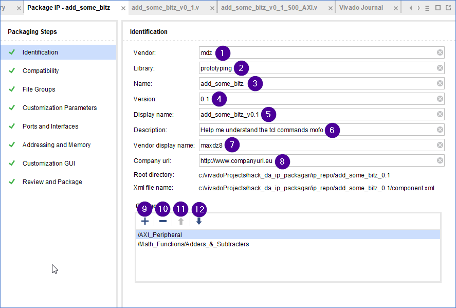
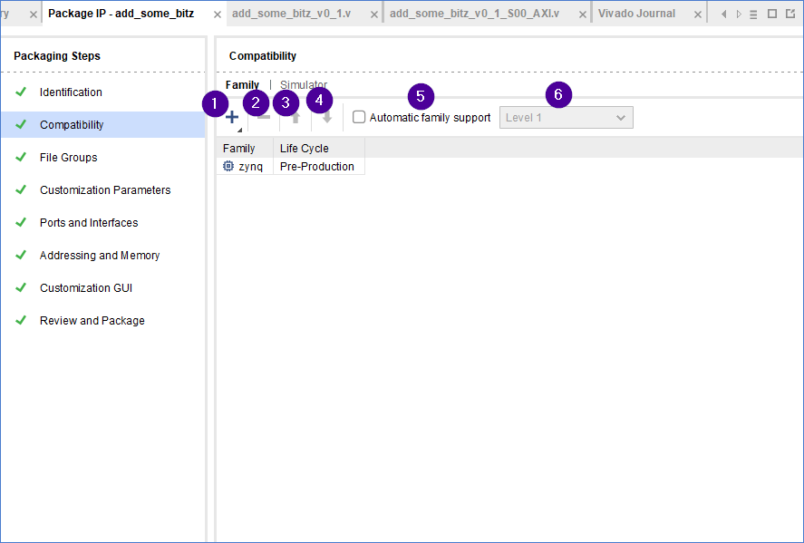
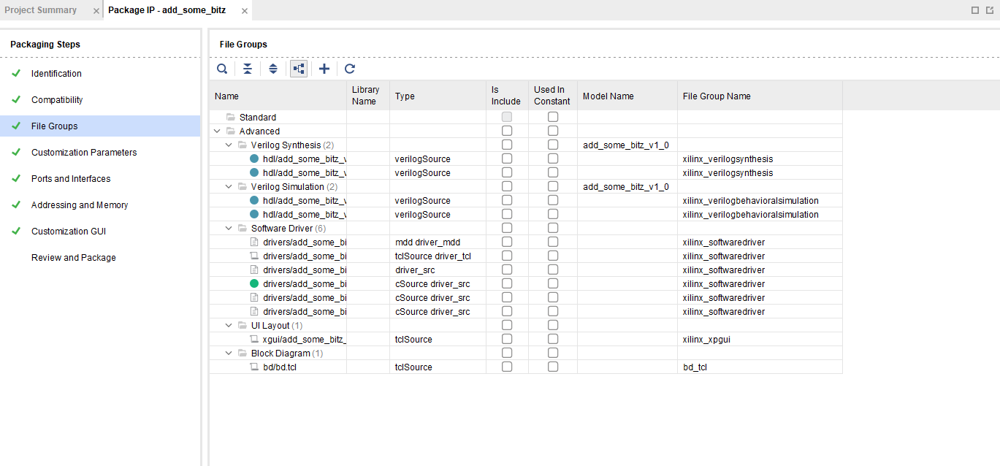
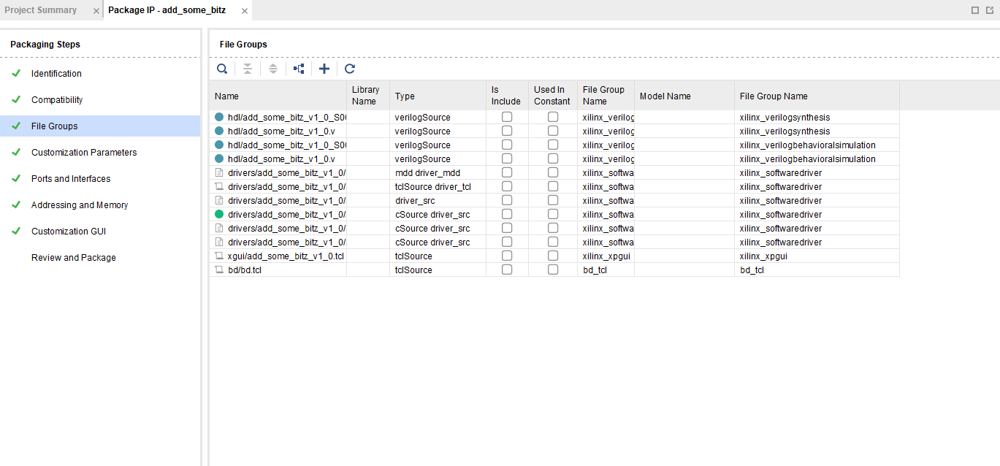
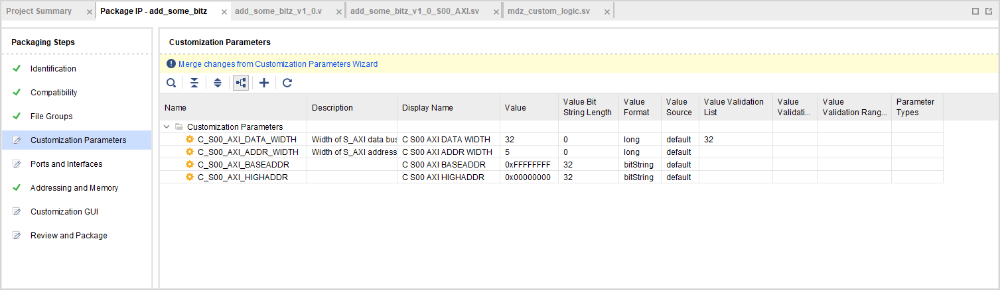
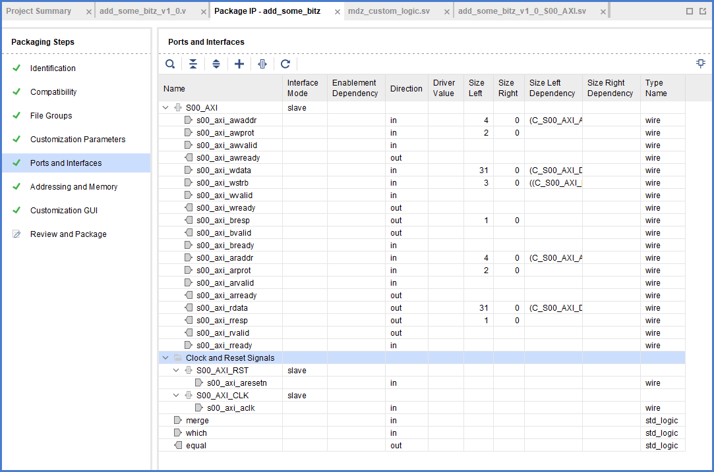

Some panels are way more complicated than others and require their own pages.

# Identification panel

1. `get_property vendor [ ipx::current_core ]`
2. `get_property library [ ipx::current_core ]`
3. `get_property name [ ipx::current_core ]`
4. `get_property version [ ipx::current_core ]`
5. `get_property display_name [ ipx::current_core ]`
6. `get_property description [ ipx::current_core ]`
7. `get_property vendor_display_name [ ipx::current_core ]`
8. `get_property company_url [ ipx::current_core ]`
9. Will pop a window where you can enable "categories", see [available taxonomies](../pseudo-reference/taxonomies.md)
10. Enabled when you click a category aka taxonomy
11. Move up a selected non-first category in the graphic list. Oddly, it doesn't seem to really change the `taxonomy` field.
12. Move down non-last, see above.

You might be interested in knowing [properties of an AXI component](../pseudo-reference/axi-component-properties.md)   

# Compatibility panel (Family)

This panel is quite easy to understand as every button basically emits the corresponding command right away. Each supported hardware is a pair of tokens (FAMILY LIFECYCLE).

1. This is kinda magic. It opens a menu allowing you to add a specific device or a regexp. They end up in emitting stuff like `set_property supported_families {zynq Pre-Production zynq{xc7z007sclg225-1} Production} [ipx::current_core]`. Note the token format, further elaborated below.
2. This button is enabled if you click on something on the table. It is vastly more straightforward than the adding.
3. Can move multiple entries
4. Can move multiple entries

## Supported families
If supporting all chips of a given family there's no need to specify the exact model. So, what families are available? This is a list produced by selecting everything in the "Add Family" dialog.

` set_property supported_families {artix7 Production artix7l Production qartix7 Production qzynq Production aartix7 Production azynq Production zynq Production} [ipx::current_core] `

## Supported life cycle tokens

There seems to be a bug in the add dialog preventing me to mix-and match. This is provided more for completeness than anything real.
You can change the lifecycle by adding the chip and then clicking on the corresponding cell in the "Life Cycle" column, no need to get crazy with the dialog.

I assume there are enumerations. Even supposing they are arbitrary strings, I would be careful not messing up with toolchain expectations.

Only one making sense: `Production` (see examples above).

Other available tokens: `Beta`, `Pre-Production`, `Discontinued`, `Superseded`, `Hidden`, `Removed`.

# Compatibility panel (Simulator)

TODO - this one doesn't really interest me.

# File Groups panel

Files can be visualized in two ways:

[Files](./dump/props_of_files.md) are contained into [file groups](./dump/file_groups.md).

# Customization Parameters panel

Aka "[HDL parameters](./hdl-parameters.md)", required to define bus widths later.

# Ports and interfaces panel

At its core, we use AXI IP to have the interfacing done for us. The whole point of the thing is therefore to build the AXI bus. There are dedicated commands such as `ipx::add_bus_interface` but ports can also exist by themselves. We'll be trying to build this:

This panel is so complicated it deserves [its own page](./ports-and-interfaces.md).
