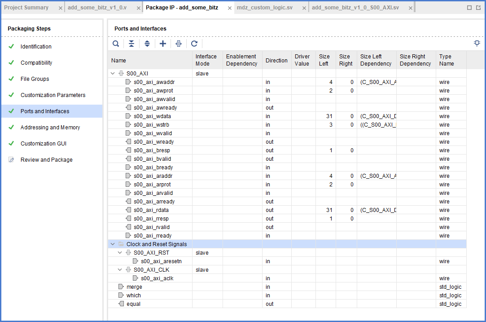

# Ports and interfaces

We probably want to conform to Xilinx and their AXI thing but what if we need additional i/o ? Let's imagine we want this:

```
module mdz_custom_logic #(
    MERGE_OP = "+",
    MERGE_LATENCY = 0
) (
    input clk,
    input merge, which, // when merge hi res = tripletA OP tripletB, otherwise res = which ? tripletB : tripletA 
    input[31:0] ai, bi, ci, di, ei, fi,
    output[31:0] q,
    output equal // high if the two triplets are the same
);

assign one = ai + bi + ci;
assign two = di + ei + fi;

wire[31:0] res;
wire equal_triplets = one == two;
if (MERGE_OP == "+") begin : op_add
    assign res = one + two;
end
else if (MERGE_OP == "^") begin : op_xor
    assign res = one ^ two;
end
else begin
    initial begin
        $display("Unsupported MERGE_OP.");
        $finish;
    end
end

wire[31:0] selected = merge ? res : (which ? two : one);
if (MERGE_LATENCY == 0) begin : out_rename
    assign q = selected;
    assign eq = equal_triplets;
end
else if (MERGE_LATENCY == 1) begin : out_ff
    int unsigned buff = 32'b0;
    always_ff @(posedge clk) buff <= selected;
    assign q = buff;
    
    bit buff_eq = 1'b0;
    always_ff @(posedge clk) buff_eq <= equal_triplets;
    assign eq = buff_eq;
end
else begin
    initial begin
        $display("Unsupported MERGE_LATENCY.");
        $finish;
    end
end

endmodule
```

I am defining two new inputs:

1. `merge` is some kind of "operation enable". If high, the result is computed by OP-ping the values. Otherwise it's a select.
2. `which` value is selected? Irrelevant when `merge` is high. Otherwise, `which` selects the first triplet if this is low, otherwise the second.

There's a new output port `equal` being high if the two triplets have the same value, otherwise it'll be low.

After modifying the file using regular project-based flow and propagating the ports to the Verilog wrapper, a merge suggestion will appear. Clicking it will evolve the thing as shown.


When I went into the panel I found the ports already configured, probably a byproduct of `ipx::merge_project_changes files`, which the export IP wizard uses profusely. 



The situation here is quite complicated. As start, consider:
```
ipx::get_bus_interfaces
bus_interface component_1 S00_AXI bus_interface component_1 S00_AXI_RST bus_interface component_1 S00_AXI_CLK
```
A table of [the various properties](../pseudo-reference/bus-interfaces.md), for each bus interface.

Ports can be defined outside of a bus interface and they can be pulled by the appropriate command:

```
ipx::get_ports
port component_2 merge port component_2 which port component_2 equal port component_2 s00_axi_aclk port component_2 s00_axi_aresetn port component_2 s00_axi_awaddr port component_2 s00_axi_awprot port component_2 s00_axi_awvalid port component_2 s00_axi_awready port component_2 s00_axi_wdata port component_2 s00_axi_wstrb port component_2 s00_axi_wvalid port component_2 s00_axi_wready port component_2 s00_axi_bresp port component_2 s00_axi_bvalid port component_2 s00_axi_bready port component_2 s00_axi_araddr port component_2 s00_axi_arprot port component_2 s00_axi_arvalid port component_2 s00_axi_arready port component_2 s00_axi_rdata port component_2 s00_axi_rresp port component_2 s00_axi_rvalid port component_2 s00_axi_rready
```

See [port values as obtained by project merge](../pseudo-reference/component-ports.md).